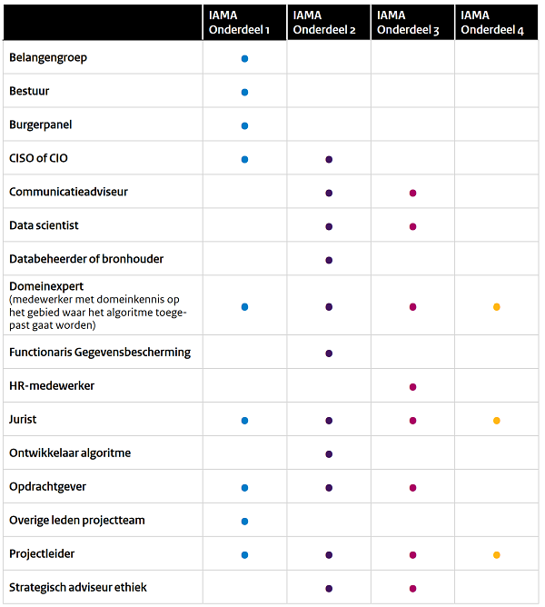
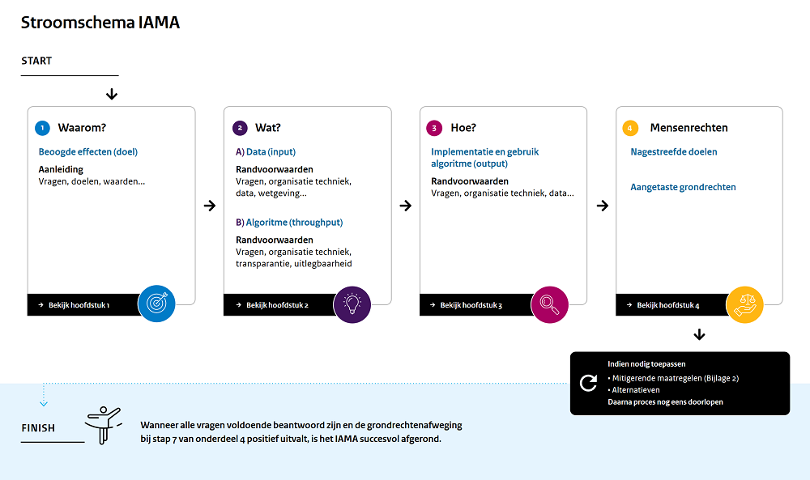

# Impact Assessment Mensenrechten en Algoritmes

Ontwikkeld door Universiteit Utrecht in opdracht van Ministerie van Binnenlandse Zaken en Koninkrijksrelaties (juli 2021).

## Inleiding – Toepassing van het IAMA

Dit impact assessment voor mensenrechten bij de inzet van algoritmen (‘IAMA’) is een
instrument voor discussie en besluitvorming voor overheidsorganen. Het instrument
maakt een interdisciplinaire dialoog mogelijk door degenen die verantwoordelijk
zijn voor de ontwikkeling en/of inzet van een algoritmisch systeem. Primair is de
opdrachtgever verantwoordelijk voor het (laten) uitvoeren van het IAMA.

Het IAMA bevat een groot aantal vragen waarover discussie plaats moet vinden en waarop een
antwoord moet worden geformuleerd in alle gevallen waarin een overheidsorgaan overweegt
een algoritme te (laten) ontwikkelen, in te kopen, aan te passen en/of in te gaan zetten (hierna
kortheidshalve: de inzet van een algoritme). Ook wanneer een algoritme al wordt ingezet kan
het IAMA dienen als instrument voor reflectie. De discussie over de verschillende vragen moet
plaatsvinden in een breed samengesteld team waarin mensen met verschillende specialisaties
en achtergronden zitting hebben. Per vraag is in het IAMA aangegeven wie in ieder geval bij
de discussie moet zijn betrokken. Alle in het schema opgenomen functies of rollen binnen een
multidisciplinair team komen in dit instrument aan bod. Veel voorkomende functies hebben
hierin een plaats gekregen, maar de lijst is niet uitputtend. Ook de benamingen van de functies
kunnen per organisatie verschillen.

De discussie op basis van het IAMA heeft als doel om ervoor te zorgen dat alle relevante
aandachtspunten rondom de inzet van algoritmen in een vroegtijdig stadium en op een
gestructureerde manier aan bod komen. Daardoor wordt tegengegaan dat al te snel
een algoritme wordt ingezet terwijl de consequenties daarvan niet goed zijn bekeken,
met de daarbij behorende risico’s, zoals die van onzorgvuldigheid, ineffectiviteit
of inbreuk op grondrechten. Om dit doel te kunnen bereiken is het belangrijk om
alle relevante stappen bij de inzet van een algoritme theoretisch door te exerceren
en grondig te doordenken wat de consequenties zijn, welke eventuele mitigerende
maatregelen kunnen worden genomen etc.

Het is de bedoeling dat per vraag de antwoorden en de belangrijkste overwegingen en
gemaakte keuzes worden vastgelegd. Het ingevulde IAMA kan dienen als naslagwerk
en ter verantwoording van het besluitvormingsproces rondom de ontwikkeling en de implementatie van een algoritme.

Om deze exercitie mogelijk te maken wordt er in het IAMA van uitgegaan dat het
besluitvormingstraject rondom algoritmen in drie hoofdfasen kan worden ingedeeld:

- **Fase 1**: voorbereiding. In deze fase wordt bepaald waarom een algoritme ingezet
gaat worden en wat daarvan de effecten zullen zijn.

- **Fase 2**: input en throughput. In deze fase gaat het om het wat van de
ontwikkeling van een algoritmisch systeem. In deze fase wordt bepaald hoe het
algoritme eruit moet zien en van welke data gebruik wordt gemaakt om het
algoritme te voeden. Binnen deze fase wordt in dit IAMA nader onderscheid
gemaakt tussen:
  - **Fase 2a**: data, of input. Het gaat daarbij om vragen waarin steeds de inzet van
bepaalde data en databronnen centraal staat
  - **Fase 2b**: algoritme, of throughput. Het gaat hier om vragen omtrent het in te
zetten algoritme en de werking en transparantie daarvan.
- **Fase 3**: output, implementatie en toezicht. In deze fase gaat het om het hoe van
het inzetten van het algoritme, dus om de vraag welke output het algoritme
genereert, hoe dat een rol kan spelen in beleid of besluitvorming, en hoe daarop
toezicht kan worden gehouden.

In alle fasen moet ervoor worden gezorgd dat grond- of mensenrechten worden
gerespecteerd. Het IAMA bevat daarom een afzonderlijk onderdeel waarin bijzondere
aandacht wordt besteed aan het identificeren van risico’s op het maken van inbreuk op
grondrechten en het kunnen vaststellen van een eventuele rechtvaardiging daarvoor.

Het IAMA bestaat uit vier delen: drie delen waarin de drie fasen van besluitvorming rondom
de inzet van een algoritme aan de orde komen, en één deel waarin de bredere vragen rondom
grondrechten centraal staan. Per deel bevat het IAMA een aantal subthema’s waarover vragen
zijn geformuleerd die in het team moeten worden besproken en beantwoord. Per subthema
wordt een nadere toelichting gegeven op de gestelde vragen.

Het IAMA hangt nauw samen met een groot aantal andere richtsnoeren, handreikingen,
toetsings-/afwegingskaders en impact assessments, waaronder de bekende
gegevensbeschermingseffectbeoordeling (GEB, vaak ook DPIA (dataprotectie impact
assessment)). In dit IAMA wordt voor verschillende onderdelen dan ook verwezen naar een
nadere uitwerking of verfijning, een grotere diepgang, of een andere terminologie of indeling
die in dergelijke instrumenten wordt gegeven. Dit gebeurt allereerst doordat per deel van het
IAMA een inleiding is opgenomen met verwijzingen naar de relevante instrumenten. Daarnaast
wordt - waar relevant - bij specifiekere vragen als onderdeel van de toelichting gewezen op
een nadere uitwerking of detaillering in een of meer van deze instrumenten; dit gebeurt steeds
in een andere kleur letters. Daarbij zijn steeds links opgenomen naar de instrumenten, zodat
daar bij de discussie gemakkelijk naar kan worden doorgeklikt.

Hierdoor kan het IAMA fungeren als een overkoepelend instrument, waarin de andere
bestaande instrumenten logisch zijn ingepast. Antwoorden die bij het IAMA al zijn gegeven,
kunnen daarbij soms ook worden ingepast bij andere instrumenten, zoals het DPIA, en
andersom.

In een aantal gevallen zal de uitkomst van een discussie op basis van een IAMA-vraag zijn dat
een algoritme problematisch kan zijn of grote risico’s in zich kan bergen. In dat geval wordt
daarop in het IAMA met **rode** letters gewezen.

## Stroomschema IAMA

## Deel 1: Waarom?

Beoogde Effecten – Doelstellingen – Randvoorwaarden

### Inleiding
Deel 1 van het IAMA gaat over het ‘Waarom?’ van het voornemen om
een algoritme te ontwikkelen, in te kopen, aan te passen en/of in te
gaan zetten (hierna kortheidshalve: de inzet van een algoritme).
Wat zijn de aanleiding, de achterliggende beweegreden en de beoogde
effecten van de inzet van het algoritme? Wat zijn de onderliggende
waarden die de insteek van het gebruik van het algoritme bepalen?
Deze overkoepelende vragen moeten in een besluitvormingsproces
over de inzet van algoritmes als eerste worden behandeld, voordat
bijvoorbeeld wordt toegekomen aan vragen over randvoorwaarden
of mogelijke impact op grondrechten. De antwoorden zijn voor het
beantwoorden van die specifiekere vragen namelijk steeds relevant.

### Instructie
*Lees voor het bediscussiëren en beantwoorden van de vraag steeds eerst
de toelichting (die volgt na de vraag). Per vraag staat in de toelichting ook
vermeld wie binnen het team in ieder geval aanwezig moeten zijn bij de
bespreking.*

**Deel 1 bouwt voort op/is gerelateerd aan:**

#### **Integraal afwegingskader beleid en regelgeving**
In het bekende integraal afwegingskader voor beleid en regelgeving (IAK) is een groot
aantal relevante handreikingen opgenomen waar het gaat om bijvoorbeeld de keuze
van beleidsinstrumenten, het identificeren van doelstellingen voor beleid en van
andere belangen en waarden, en het bepalen van de rechtmatigheid van beleid en
regelgeving. Dit eerste deel van het IAMA sluit zo goed mogelijk aan bij dit kader door
een specifiekere vertaling te geven van de daarin opgenomen uitgangspunten naar de
context van het inzetten van een algoritme voor besluitvorming of beleid. Als bepaalde
vragen in dit eerste deel een nadere toelichting vergen, kan daarvoor in de meeste
gevallen in het IAK te rade worden gegaan.

#### **Toetsingskader Algemene Rekenkamer**
Dit toetsingskader bevat aanknopingspunten voor audits van ingezette algoritmen.
De daarin neergelegde beschrijvingen van risico’s, bijvoorbeeld ten aanzien van het
formuleren van doelstellingen van een algoritme of de wettelijke grondslag daarvan,
kunnen behulpzaam zijn bij het bediscussiëren van de hiernavolgende IAMA-vragen.
Zij maken onder meer duidelijk hoe en hoe specifiek bepaalde doelen moeten worden
geformuleerd en welke keuzes moeten worden onderbouwd.

#### **Ethische Richtsnoeren voor betrouwbare Kunstmatige Intelligentie**
Deze vanuit de EU ontwikkelde richtsnoeren hebben tot doel te waarborgen dat algoritmen
wettig, ethisch en robuust zijn en schetsen een kader om dat te bewerkstelligen. Principes
als autonomie, schadepreventie, rechtvaardigheid en verantwoording staan daarbij
centraal. Deze principes spelen een belangrijke rol bij de discussie over de vragen in dit
eerste deel van het IAMA. Het is daarom goed om deze richtsnoeren in de discussie te
betrekken, ook waar het gaat om het beantwoorden van vragen over de doelen van het
inzetten van een algoritme en de andere vragen in dit eerste deel van het IAMA.

#### **Handreiking non-discriminatie by design (Onderdeel 1: probleemdefinitie)**
In dit onderdeel van de handreiking komen soortgelijke punten aan de orde als in het
onderhavige deel van het IAMA, maar dan specifiek gericht op het aanpakken van
ongerechtvaardigde ongelijke behandeling in de data. De handreiking kan dan ook worden
gebruikt als verdieping en nadere toelichting bij de hieronder geformuleerde vragen, die
meer algemeen gericht zijn op de ontwikkeling en inzet van algoritmen.

#### **Code Goed Digitaal Openbaar Bestuur**
In deze code wordt aandacht besteed aan een ruime reeks rechtsstatelijke en
zorgvuldigheidswaarborgen die in procedures van algoritmische besluitvorming worden
betrokken. Ook in processen van besluitvorming rondom de inzet van een algoritme
moeten deze waarborgen uiteraard in acht worden genomen. De hierna genoemde vragen
moeten dan ook tegen de achtergrond van deze Code worden beantwoord.

#### **DPIA-checklist Autoriteit Persoonsgegevens**
In dit deel van het IAMA worden onder meer vragen geformuleerd over de doelen van het
inzetten van een algoritme. Dergelijke vragen moeten ook worden beantwoord als er een
Data Protection Impact Assessment moet worden uitgevoerd (DPIA). Zo’n DPIA zal bij de
inzet van veel algoritmische systemen nodig zijn, zeker wanneer deze inzet impliceert dat
er persoonsgegevens worden verwerkt. Bij het uitvoeren van een DPIA moet onder meer
worden geïdentificeerd wat de doelen zijn van de verwerking van gegevens. Die doelen
kunnen ook relevant zijn voor de keuzes rondom de inzet van het algoritme als zodanig.
Om die reden kan het nuttig zijn om de bij een DPIA al gemaakte analyse te betrekken
bij het bediscussiëren van de IAMA-vragen, terwijl andersom de in dit deel van het IAMA
gegeven antwoorden nuttig kunnen zijn bij het maken van een DPIA. Belangrijk is dat een DPIA niet altijd hoeft te worden uitgevoerd en dat het bij een DPIA gaat om een smallere
beoordeling dan bij het IAMA; het gaat bij een DPIA immers prima om verwerking van
persoonsgegevens, terwijl bij de besluitvorming rondom de inzet van een algoritme veel
meer elementen kunnen komen kijken. Een DPIA kan de toetsing aan het IAMA dan ook
niet vervangen. Een checklist voor de vraag wanneer een DPIA moet worden uitgevoerd en
een aantal richtsnoeren voor het uitvoeren van een DPIA is te vinden op de website van de
Autoriteit Persoonsgegevens.

### 1.1 Aanleiding en probleemdefinitie

#### 1.1.1 Licht uw voorstel voor het gebruik/de inzet van een algoritme toe. Wat is de aanleiding hiervoor geweest? Voor welk probleem moet het algoritme een oplossing bieden?

*Beschrijf hier beknopt het voorstel, zodanig dat een buitenstaander zou kunnen begrijpen wat u van plan bent.*

**Let op:** de doelstelling van het algoritme komt hierna afzonderlijk, bij vraag 1.2, aan bod.

##### **Aanwijzingen en toelichting**

*Benodigde expertise/rol voor beantwoording van deze vraag: opdrachtgever, projectleider,
domeinexpert, evt. panel van burgers, evt. vertegenwoordiger van belangengroep*

Bij de eerste vraag van dit thema gaat het erom na te denken over wat nu eigenlijk de
**aanleiding** is om een algoritme in te willen zetten: wat is het probleem waarvoor de
beoogde inzet van het algoritme een oplossing zou moeten vormen? Het gaat hierbij
dus om **probleemdefinitie en -afbakening**. Daarbij is het essentieel om het probleem zo
concreet en precies mogelijk te krijgen. Soms kan het probleem of de aanleiding een interne
aangelegenheid zijn: interne processen verlopen niet efficiënt of kunnen efficiënter worden
gemaakt door de inzet van een algoritme. In andere gevallen kan een algoritme worden
ingezet om een maatschappelijk probleem of een probleem bij een bepaalde bevolkingsgroep
op te lossen.

Hoofddoel van de tweede vraag bij dit thema is om te bepalen **waarom het gewenst of nodig
is om een algoritme in te zetten** , wetende dat er vaak ook andere (niet-digitale) instrumenten
beschikbaar kunnen zijn om een probleem te kunnen aanpakken. Er moet vanuit dat
perspectief een discussie plaatsvinden over de vraag waarom een algoritme een betere
oplossing kan bieden dan een niet-geautomatiseerd of niet-digitaal proces.
 
Ook de **Handreiking non-discriminatie by design** bevat informatie over de noodzaak van een
goede probleemdefinitie bij de inzet van een algoritme. Daarnaast is in het **Toetsingskader
Algemene Rekenkamer** de nodige informatie te vinden over de vraag hoe specifiek de doelen
moeten worden geformuleerd.
 
Om goede participatie van burgers te realiseren, vroegtijdig inzicht te verkrijgen in
verschillende gezichtspunten en draagvlak voor de inzet van een algoritme te creëren kan
het nuttig zijn om burgers te betrekken bij het definiëren van de doelstellingen. Dat kan
bijvoorbeeld door een **burgerpanel** vragen voor te leggen over de doelen van het algoritme.
Een andere optie is het betrekken van een vertegenwoordiger van een **belangengroep**.
Belangengroepen hebben een grote inhoudelijke expertise en zijn specifiek in het leven
geroepen om groepen van betrokkenen te representeren.
 
Meer informatie over de wenselijkheid en mogelijkheden van het betrekken van burgers
bij de besluitvorming rondom de inzet van digitale middelen, waaronder algoritmes,
is te vinden in de **Code Goed Digitaal Openbaar Bestuur**. 
 
### 1.2 Doelstelling

#### **1.2.1 Wat is het doel dat bereikt dient te worden met de inzet van het algoritme? Wat is hierbij het hoofddoel en wat zijn subdoelen?**
 
##### **Aanwijzingen en toelichting**

*Benodigde expertise/rol voor beantwoording van deze vraag: opdrachtgever, projectleider,
evt. panel van burgers, evt. vertegenwoordiger van belangengroep*

Het zo expliciet mogelijk maken van de doelstelling is belangrijk, omdat in een later stadium
de prestaties van het algoritme getoetst moeten kunnen worden aan de doelstelling.
Een algoritme ontwikkelen vanuit goede intenties alleen is niet voldoende om het ontbreken
van ongewenste effecten te waarborgen. Daarnaast moet het beoogde doel legitiem zijn.

Voortbouwend op de probleemdefinitie bij 1.1 is het zaak om **het doel van de inzet van een
algoritme zo concreet en specifiek mogelijk te definiëren**. Dus niet (alleen): ‘bescherming van de
nationale veiligheid’, maar (ook) ‘het geautomatiseerd in kaart kunnen brengen en analyseren
van indicatoren voor terrorismerisico’s op bepaalde locaties’. Ook doelen van efficiëntie
of kostenbesparing kunnen worden geïdentificeerd, bijvoorbeeld: ‘geautomatiseerde
tekstanalyse om de werkdruk voor medewerkers significant terug te dringen en in het
volgende jaar 4 fte minder aan personeel nodig te hebben’. Waar mogelijk is het goed om de
doelstellingen te kwantificeren.

Daarnaast is het belangrijk om een zekere **rangorde** te maken als er **meer doelen** zijn (dat is
bijna altijd zo): wat zijn de belangrijkste doelen en waarom? Welke doelen zijn ‘subdoelen’,
waarvoor het niet zo erg is als ze niet voor 100% kunnen worden gerealiseerd?

Als ook een DPIA wordt uitgevoerd – bijvoorbeeld omdat verwacht wordt dat bij de
ontwikkeling of inzet van het algoritme persoonsgegevens worden gebruikt – is het daarbij
nodig om de doelen van gegevensverwerking te definiëren. Deze doelen kunnen overlappen
met de doelen van het inzetten van een algoritme (al is dat niet noodzakelijk). Het kan dus
handig zijn om de bij het IAMA gedefinieerde doelen te bewaren en ze ook in te zetten bij
een DPIA, of andersom. Meer informatie over het uitvoeren van een DPIA is te vinden in de
Checklist DPIA van de Autoriteit Persoonsgegevens.
 
Voor informatie over het bepalen van de doelen van de inzet van een algoritme kan verder
te rade worden gegaan bij de Handreiking non-discriminatie by design en het Toetsingskader
Algemene Rekenkamer.
 
Om goede participatie van burgers te realiseren en draagvlak voor de inzet van een algoritme
te creëren kan het nuttig zijn om burgers te betrekken bij het definiëren van de doelstellingen.
Dat kan bijvoorbeeld door een burgerpanel vragen voor te leggen over de doelen van
het algoritme. Een andere optie is het betrekken van een vertegenwoordiger van een
belangengroep. Belangengroepen hebben een grote inhoudelijke expertise en zijn in het leven
geroepen om groepen van betrokkenen te representeren.
 
Meer informatie over de wenselijkheid en mogelijkheden van het betrekken van burgers bij
de besluitvorming rondom de inzet van digitale middelen, waaronder algoritmes,
is te vinden in de Code Goed Digitaal Openbaar Bestuur.
 
### 1.3 Publieke waarden

#### **1.3.1 Wat zijn de publieke waarden die de inzet van het algoritme ingeven? Indien meerdere publieke waarden de inzet van het algoritme ingeven, kan daar een rangschikking in aangebracht worden?**
 
#### **1.3.2 Wat zijn de publieke waarden die mogelijk in het gedrang komen door de inzet van het algoritme?**
 
##### **Aanwijzingen en toelichting**

*Benodigde expertise/rol voor beantwoording van deze vraag: opdrachtgever, bestuur,
jurist, evt. burgerpanel, evt. vertegenwoordiger van belangengroep*

Concreet is het de bedoeling dat de waarden die de ontwikkeling en het gebruik van het
betreffende algoritme ingeven, **expliciet worden gemaakt**. Het expliciet maken van de waarden
die besloten moeten liggen in het algoritme, kan helpen om de evaluatie van de effecten van
het algoritme, in een latere fase van het proces, te vergemakkelijken.

Het is niet altijd gemakkelijk om te weten wat publieke waarden zijn, maar het gaat steeds om
manifestaties van het algemeen belang. De specifieke **publieke waarden** die overheidshandelen
ingeven, kunnen daarbij van situatie tot situatie verschillen. Vaak worden publieke waarden
gedestilleerd uit essentiële **rechtsstatelijke en democratische grondbeginselen,** uit **voorwaarden
om een samenleving goed te kunnen laten functioneren** , en uit individuele en collectieve
grondrechten en vrijheden.

Voorbeelden van publieke waarden zijn gelijkwaardigheid, respect voor persoonlijke
autonomie, solidariteit, vrijheid, veiligheid, verantwoordelijkheid, duurzaamheid,
rechtszekerheid, verdelende rechtvaardigheid, respect voor kwetsbare groepen, participatie
en efficiënte besteding van middelen. Op een concreter niveau kan ook bescherming van
grondrechten (zoals persoonsgegevensbescherming, vrijheid van meningsuiting, het recht op
toegang tot informatie en het recht op een eerlijk proces) tot de publieke waarden worden
gerekend.

Algoritmen kunnen dienen om bepaalde publieke waarden te vertalen naar concrete
besluitvorming. Daarbij kunnen algoritmen bepaalde waarden versterken, maar ze kunnen ook
publieke waarden - zoals grondrechten - aantasten. Juist daarom is het belangrijk om in kaart
te brengen welke publieke waarden aan de orde kunnen zijn bij de inzet van het algoritme.
 
Bij de beantwoording van deze vraag kan rekening worden gehouden met de aanleiding voor
de inzet van het algoritme (zie vraag 1.1) en de doelen ervan (zie vraag 1.2), maar ook met de
kernwaarden van de organisatie of de afdeling die het algoritme gaat gebruiken. Daarnaast
moet aandacht worden besteed aan het grondrechtenstappenplan (zie deel 4 van dit IAMA) en
het overzicht van grondrechtenclusters in bijlage 1. Als grondrechten kunnen worden geraakt
door het algoritme, of als grondrechten juist kunnen worden bevorderd door het algoritme,
betekent dit namelijk dat grondrechten als publieke waarden aan de orde zijn.
 
Wanneer meerdere publieke waarden de inzet van het algoritme ingeven, is het nuttig om na te
denken over het relatieve gewicht van deze waarden. Welke waarden zijn het meest belangrijk?
Hoe erg is het als deze niet (volledig) kunnen worden gerealiseerd met de inzet van het
algoritme?
 
Als sprake is van een **botsing van publieke waarden** bij de inzet van het algoritme, moet een
**afweging** worden gemaakt. Het kan moeilijk zijn om dit in dit stadium van het IAMA al te
doen, dus het is verstandig om nu niet meer te doen dan deze spanning te signaleren.
Het doel van het nu al identificeren van de diverse betrokken waarden is vooral gericht
op bewustwording en bewustzijn; bij het doorlopen van de vragen in de vervolgdelen
van dit IAMA kunnen de betrokken belangen en eventuele spanningsverhoudingen in het
achterhoofd worden gehouden. Uiteindelijk zal in ieder geval bij stappen 5, 6 en 7 van het
grondrechtenstappenplan (zie deel 4 van dit IAMA) aandacht moeten worden besteed aan de
wenselijkheid van de inzet van het algoritme in het licht van de waarden en grondrechten die
erdoor worden geraakt. Daar zal ook een afweging moeten worden gemaakt als er sprake is
van grondrechtenbotsingen die niet op een adequate manier kunnen worden weggenomen.

Voor informatie over het bepalen van de eventuele (positieve en negatieve) impact van
de inzet van een algoritme op publieke waarden kan verder te rade worden gegaan bij
de **Handreiking non-discriminatie by design** , **Code Goed Digitaal Openbaar Bestuur** en het
**Toetsingskader Algemene Rekenkamer**.

Om goede participatie van burgers te realiseren en draagvlak voor de inzet van een algoritme
te creëren kan het nuttig zijn om burgers te betrekken bij de discussie over de betrokken
publieke waarden. Dat kan bijvoorbeeld door een burgerpanel vragen voor te leggen
over de verwachte positieve en negatieve impact van het algoritme en de daartussen te
maken afwegingen. Een andere optie is het betrekken van een vertegenwoordiger van een
belangengroep. Belangengroepen hebben vaak een grote inhoudelijke expertise en zijn in het
leven geroepen om groepen van betrokkenen te representeren.
 
Meer informatie over de wenselijkheid en mogelijkheden van het betrekken van burgers
bij de besluitvorming rondom de inzet van digitale middelen, waaronder algoritmes,
bij besluitvorming en beleid is te vinden in de Code Goed Digitaal Openbaar Bestuur.
 
### 1.4 Wettelijke grondslag

#### **1.4.1 Wat is de wettelijke grondslag van de inzet van dit algoritme en van de beoogde besluiten die genomen zullen worden op basis van dit algoritme?**

##### **Aanwijzingen en toelichting**

*Benodigde expertise/rol voor beantwoording van deze vraag: jurist, opdrachtgever*
 
Bij de beantwoording van deze vraag gaat het erom na te gaan of er een wettelijke
grondslag bestaat die – concreet en in heldere bewoordingen – de mogelijkheid biedt
om een algoritme in te zetten en deze inzet voldoende voorzienbaar maakt. Als de
verwachting is dat een algoritme tot gevolg heeft dat wordt ingegrepen in het leven
of de vrijheid van mensen, en zeker als de verwachting is dat er grondrechten worden
geraakt, moet er een wettelijke grondslag bestaan voor de inzet van het algoritme.
 
**Ontbreekt in een dergelijk geval een wettelijke grondslag die aan de kwaliteitseisen voldoet, dan mag
het algoritme niet worden ingezet.**
 
*NB: aan het wettigheidsvereiste gerelateerde vereisten rondom behoorlijk en goed bestuur,
transparantie en rechtsbescherming komen in de hiernavolgende delen van het IAMA nader
aan de orde.*
 
In een aantal gevallen – in het bijzonder als het algoritme een inbreuk kan maken op een van
de grondrechten zoals die in de Grondwet zijn vastgelegd – moet sprake zijn van een grondslag
in een **formele wet**. (Vetzo, Gerards & Nehmelman 2018, p. 53 e.v.; Koops e.a. 2017) In andere gevallen van ingrijpend overheidshandelen kan een **lagere
regeling** (bijvoorbeeld een AMvB) als grondslag volstaan.

Bij **grondrechteninbreuken** (zie deel 4 van dit IAMA) gelden op grond van het Europees Verdrag
voor de Rechten van de Mens een aantal aanvullende vereisten, waarvan er twee voor de inzet
van algoritmes bijzonder van belang zijn:
- De grondrechteninbreuk moet **voldoende voorzienbaar** zijn. Dat betekent dat de wettelijke
grondslag zo duidelijk moet zijn geformuleerd dat burgers en rechtspersonen kunnen
weten waar ze aan toe zijn en zo nodig hun handelen kunnen afstemmen op de verwachte
gevolgen.
- De wettelijke grondslag moet voldoende waarborgen bieden tegen willekeur. Dat betekent
onder meer dat het toegestane handelen (bijvoorbeeld besluitvorming met behulp van
een algoritme) moet worden omkleed met de nodige waarborgen tegen willekeur, dat
er voldoende transparantie moet bestaan rondom de te nemen besluiten, en dat er
voldoende mogelijkheden tot rechtsbescherming moeten bestaan.
 
Nadere specificatie van de eisen voor de wettige inzet van algoritmes is te vinden in het
Toetsingskader Algemene Rekenkamer ) en in de Ethische Richtsnoeren voor betrouwbare
Kunstmatige Intelligentie van de EU. Ook het Integraal afwegingskader voor beleid en regelgeving
biedt aanknopingspunten voor het bepalen van rechtmatigheid van voorgenomen wetgeving
en beleid, die ook gelden als het gaat om de inzet van algoritmen. In de Code Goed Digitaal
Openbaar Bestuur wordt eveneens aandacht besteed aan het wettigheidsvereiste.
De discussie over de wettelijke grondslag moet in het licht van de in deze instrumenten
gegeven toelichtingen worden gevoerd.
 
### 1.5 Betrokkenen en verantwoordelijkheden

#### **1.5.1 Welke partijen en personen zijn er bij de ontwikkeling/het gebruik/het onderhoud van het algoritme betrokken?**

#### **1.5.2 Hoe zijn de verantwoordelijkheden belegd ten aanzien van de ontwikkeling en de inzet van het algoritme, ook nadat het algoritme eenmaal is afgerond?**

#### **1.5.3 Wie is eindverantwoordelijk voor het algoritme?**

##### **Aanwijzingen en toelichting**

*Benodigde expertise/rol voor beantwoording van deze vraag: opdrachtgever,
projectleider, overige leden projectteam, CISO of CIO*
 
Besteed bij het beantwoorden van deze vraag ook aandacht aan de volgende
punten:
 
- Indien meerdere partijen betrokken zijn bij de ontwikkeling/het
gebruik/het onderhoud van het algoritme: kunnen de partijen en hun
rollen expliciet gemaakt worden?
- Indien in de toekomst blijkt dat het algoritme niet meer gewenst/
haalbaar/relevant is, is een exitstrategie dan mogelijk? Hoe zou een
dergelijke exitstrategie eruit kunnen zien?

**Als het niet mogelijk is om de verantwoordelijkheden van betrokkenen voldoende te
borgen, mag het algoritme niet worden ingezet.**
 
Het kan verleidelijk zijn om vooral vanuit een beleids- of bestuurlijk perspectief naar de inzet
van het algoritme te kijken. Er kan echter een discrepantie bestaan tussen de bestuurlijk-
beleidsmatige besluitvorming over algoritmes en de politieke verantwoordelijkheid daarvoor
en controle daarop. Ook is er een risico dat het burgerperspectief uit beeld verdwijnt als het
gaat om besluitvorming over de inzet van algoritmes, mede doordat participatie door burgers
bij de discussie over de inzet van algoritmes vaak beperkt is (Zie ook Vetzo, Gerards & Nehmelman 2018). Het is daarom belangrijk om in
de discussie te bedenken of, naast **bestuurlijk verantwoordelijken** , ook **politiek verantwoordelijken**
en **burgers** een rol kunnen of moeten hebben bij de besluitvorming over de inzet van het
algoritme en, zo ja, hoe die rol vorm moet krijgen. Niet voor niets is bij de eerdere vragen ook al
gesuggereerd om ook een burgerpanel bij de discussie te betrekken of op een andere manier te
zorgen voor burgerparticipatie.

Waar mogelijk en relevant is het wenselijk dat burgers ook in staat worden gesteld om in het
vervolgtraject (dus de fases 2 en 3 en de grondrechtentoets van **deel 4** ) mee te denken over de
ontwikkeling van een algoritme (Gerards 2019a). Al in de beginfase van de ontwikkeling van een algoritme kan
nagedacht worden over het al dan niet toepassen van **burgerparticipatie** en de manier waarop die
participatie vorm kan krijgen.

In ieder geval – en ook wanneer geen burgerparticipatie wordt voorzien – moet worden
nagedacht over de manier waarop burgers worden geraakt door het in te zetten algoritme en **hoe
de positie van burgers op een goede manier kan worden beschermd**.

Daarbij moet enerzijds aandacht bestaan voor het belang van maatwerk en voor de menselijke
maat, terwijl anderzijds gelijke behandeling en consistentie moeten worden gegarandeerd en
willekeur moet worden uitgesloten. De besluitvormingslijnen moeten zo worden vormgegeven
dat ze oog houden voor deze risico’s en spanningsverhoudingen. Nagedacht moet worden over
de manier waarop ruimte kan worden geboden voor flexibiliteit, afwijking van de norm etc. (Vgl. Altman 2015)
 
Het belang bij het vroegtijdig betrekken van alle belanghebbenden en andere mogelijke
betrokkenen – voor zover mogelijk en relevant – bij de ontwikkeling van een komt
ook naar voren in de Handreiking non-discriminatie by design. Daarin worden concrete
aanknopingspunten geboden die in de discussie kunnen worden betrokken.
 
Op de betrokkenheid van verschillende spelers en de relatie tussen bestuurlijke en politieke
spelers en burgers wordt bovendien nader ingegaan in de Code Goed Digitaal Openbaar Bestuur.
Ook met de daar geformuleerde handvatten kan in de discussie over deze vraag rekening
worden gehouden.
 
Aan het vastleggen en borgen van de verschillende rollen en taken van betrokkenen en
verantwoordelijkheden worden verder de nodige eisen gesteld in het Toetsingskader Algemene
Rekenkamer.

Een **duidelijke verdeling en borging van (verschillende niveaus van) verantwoordelijkheden** is
cruciaal voor het effectief en verantwoord verloop van het proces rondom de inzet van een
algoritme. Zeker wanneer ongewenste effecten (kunnen) optreden bij de implementatie van
een algoritme zijn korte lijnen en een duidelijke taakverdeling belangrijk voor het doen van
aanpassingen of voor de inzet van mitigerende maatregelen (zie voor een overzicht daarvan
bijlage 2). Hierover moet op voorhand al worden nagedacht; voorzien moet worden in goede
**besluitvormingsstructuren en organisatorische inbedding** van het algoritme.

Deze duidelijke verdeling van verantwoordelijkheden dient **ook in de toekomst geborgd**
te blijven. Het is bijvoorbeeld niet ondenkbaar dat bepaalde collega’s van baan wisselen
of om andere redenen hun functie niet kunnen voortzetten. Ook kan het voorkomen dat
(onderdelen binnen) de organisatie gereorganiseerd worden. Centraal in de discussie over
deze thema’s staat dan ook de vraag hoe er binnen de organisatie voor worden gezorgd
dat verantwoordelijkheden en relevante contextuele kennis goed belegd blijven, ook in de
toekomst?

Wanneer, om welke reden dan ook, blijkt dat ontwikkeling of implementatie van het algoritme
niet meer gewenst is, moet het mogelijk zijn om een **exitstrategie** te volgen. Dit is belangrijk,
omdat het soms voor kan komen dat een organisatie al ‘te diep’ in het project zit en het
lijkt alsof er geen weg terug meer mogelijk is. Dit kan schadelijke consequenties tot gevolg
hebben, zoals de verspilling van publieke middelen of de inzet van een inaccuraat algoritme.
Met een exitstrategie wordt dit voorkomen. De exitstrategie hoeft niet van tevoren al volledig
uitgewerkt te worden; hoofdlijnen kunnen volstaan.

Hierbij is ook van belang dat wordt nagedacht over de valkuilen die kunnen bestaan als mensen
met behulp van algoritmen besluiten nemen; het is zaak om al in een vroegtijdig stadium
te bedenken hoe dergelijke valkuilen kunnen worden vermeden. Denk hierbij aan valkuilen
omtrent cognitieve vooringenomenheid, bijvoorbeeld automation bias: mensen zijn geneigd
om besluiten die zijn gegenereerd door een computer als neutraal te zien en ze daardoor
sneller voor waar aan te nemen. Een ander voorbeeld van cognitieve vooringenomenheid is
anchoring: mensen zijn geneigd om het als eerste aangeboden stukje informatie als ‘anker’
of ijkpunt te gebruiken en daar niet snel van af te wijken wanneer later tegenstrijdige of
aanvullende informatie aangeboden wordt.
 
## Deel 2A: Wat? 
### Data - Input

### Inleiding
Als eenmaal vaststaat waarom een algoritme zal worden ingezet en hoe de
organisatorische borging van publieke waarden en belangen vorm zal krijgen, is het zaak
om na te denken over de vormgeving van het in te zetten algoritme. Daarop heeft deel 2
van dit IAMA betrekking, dat gaat over het ‘Wat?’ van het project.
 
Dit deel valt uiteen in twee onderdelen: deel 2a betreft de input van het algoritme: de
data (of digitaal vastgelegde gegevens) die gebruikt gaat worden en de randvoorwaarden
daaromheen. Deel 2b betreft het algoritme zelf, dus de throughput van het project.
 
Net als deel 1 omvat deel 2 een aantal vragen en punten die in ieder besluitvormingsproces
over de inzet van een algoritme moeten worden meegenomen.
 
### Instructie
_Lees voor het bediscussiëren en beantwoorden van de vraag steeds eerst de toelichting (die
volgt na de vraag). Per vraag staat in de toelichting ook vermeld wie binnen het team in ieder
geval aanwezig moeten zijn bij de bespreking._

**Delen 2a en 2b bouwen voort op/zijn gerelateerd aan:

- **Handreiking non-discriminatie by design (onderdelen 2: dataverzameling; 3: datavoorbereiding; 4:
modellering)**
In deze handreiking komen soortgelijke punten aan de orde als in het onderhavige deel van
het IAMA, maar dan specifiek gericht op het aanpakken van bias of ongelijke behandeling in
de data. De handreiking kan dan ook worden gebruikt als verdieping en nadere toelichting
bij de discussie over de hieronder geformuleerde vragen, in het bijzonder waar het gaat om
het controleren van de data op bias.

- **Toetsingskader algoritmes (in: Aandacht voor algoritmes) (Algemene Rekenkamer, 2020)**
Dit toetsingskader formuleert vijf perspectieven die moeten worden betrokken in
de besluitvorming over algoritmes, waarvan een van deze perspectieven (ethiek)
overkoepelend is voor de andere vier perspectieven (sturing en verantwoording, model
en data, privacy en ‘IT general controls’). De definities en toetsingsonderdelen die in dit
toetsingskader worden gegeven kunnen worden meegenomen bij de relevante vragen in
dit deel van het IAMA, specifiek waar het gaat om veiligheid (deel 2a) en rekenschap en
verantwoording (deel 2B). Het element privacy uit het ARK-toetsingskader komt meer
specifiek aan de orde in deel 4 (grondrechtenstappenplan).
 
- **Richtlijnen voor de uitvoering van een Data Protection Impact Assessment (DPIA) (Autoriteit
Persoonsgegevens)**
In veel gevallen zal bij het ontwikkelen en inzetten van een algoritme sprake zijn van
verzameling en verwerking van persoonsgegevens. In die gevallen moet vaak een
DPIA worden uitgevoerd. Nu het hierbij gaat om een verfijning van het grondrecht op
gegevensbescherming, besteden we hieraan aandacht in deel 4 van het IAMA – het
grondrechtenstappenplan (stap 2).
In deel 1 van het IAMA is daarnaast ook al aandacht besteed aan het DPIA, namelijk voor
zover het gaat om het formuleren van doelen van de verwerking van persoonsgegevens.
De bij het uitvoeren van een DPIA gegenereerde informatie en antwoorden kunnen
ook relevant zijn bij het discussiëren over de IAMA-vragen hierna; andersom kunnen de
antwoorden op de IAMA-vragen nuttig zijn bij het uitvoeren van een DPIA.
 
- **Richtlijnen voor het Toepassen van Algoritmen door Overheden**
In deze richtlijnen staan de thema’s transparantie, uitlegbaarheid, validatie,
verantwoording en toetsbaarheid centraal. Deze thema’s komen ook in de vragen in dit
deel van het IAMA aan bod. Deze richtlijnen zijn van belang bij de discussie over vragen die
op deze onderwerpen betrekking hebben, nu er een nadere toelichting in is te vinden over
de genoemde onderwerpen.*

- **Ethische Richtsnoeren voor betrouwbare Kunstmatige Intelligentie**
Vertrekpunt van de vanuit de EU geformuleerde ethische richtsnoeren is dat moet
worden voorzien in ‘betrouwbare’ KI door 1) menselijke controle en menselijk toezicht, 2)
technische robuustheid en veiligheid, 3) privacy en datagovernance, 4) transparantie, 5)
diversiteit, non- discriminatie en rechtvaardigheid, 6) milieu- en maatschappelijk welzijn en 7) verantwoordingsplicht. Deze verschillende punten komen hierna op verschillende punten
en manieren terug, waarbij aan punt 5 vooral aandacht wordt besteed in deel 4 van het
IAMA (grondrechtenstappenplan) en punt 6 bij deel 1 aan de orde is gekomen (identificatie
van publieke waarden). Daarnaast wordt in de richtlijnen veel aandacht besteed aan
betrokkenheid/participatie, aan controleerbaarheid en aan informatievoorziening. Ook
deze punten komen in dit deel van het IAMA aan de orde. De richtlijnen kunnen daarbij
nadere invulling geven aan de verschillende vragen en kunnen behulpzaam zijn als er
twijfels opkomen. Daarnaast vormt de in de richtsnoeren opgenomen ‘controlelijst’ een
nadere verfijning van de hierna opgenomen vragen.

- **Baseline Informatiebeveiliging Overheid (BIO)**
De BIO is een gezamenlijk toetsingskader voor informatiebeveiliging binnen de gehele
overheid. Het is van belang om de BIO in acht te nemen bij de vragen over beveiliging in
deel 2a.
 
- **De FAIR- en FACT-principes**
De FAIR- en FACT-principes gaan ervanuit dat de inzet van big data alleen bijdraagt aan een
betere maatschappij voor iedereen wanneer ze zijn ontwikkeld met belangrijke publieke
waarden als uitgangspunt. De FAIR-principes gaan over traceerbaarheid, toegankelijkheid,
interoperabiliteit en herbruikbaarheid. De FACT-principes gaan over eerlijkheid,
nauwkeurigheid, vertrouwelijkheid en transparantie.

### 2A.1 Inschatting: type algoritme
 
#### **2A.1.1 Wat voor type algoritme wordt gebruikt, of wat voor type algoritme gaat ontwikkeld worden?**

##### **Aanwijzingen en toelichting**

*Benodigde expertise/rol voor beantwoording van deze vraag:
data scientist, ontwikkelaar algoritme, projectleider*

De discussie over de keuze voor een bepaald type algoritme wordt uitgebreid
gevoerd in het volgende onderdeel van het IAMA (Deel 2B: Wat? | ‘Algoritme -
throughput’). Toch komt deze vraag hier ook alvast aan bod. Wanneer er namelijk
nog geen ruw idee bestaat over welk type algoritme ingezet gaat worden, zijn de
volgende vragen van dit IAMA-deel, die over data gaan, niet goed te beantwoorden.
Bij de beantwoording van deze vraag kan het handig zijn om al even te kijken naar de
varianten die bij vraag 2B.1 worden genoemd.
 
Afhankelijk van het antwoord op de vraag of er al een beeld is van het in te zetten algoritme,
zijn er voor de discussie verschillende opties:
- Als er al een ruw (of meer omlijnd) idee is van het in te zetten algoritme, kunnen
de vragen hierna voor dat algoritme worden bediscussieerd.
- Als er verschillende te overwegen typen van algoritmes zijn, kunnen de vragen
aan de orde komen voor de verschillende typen.
- Als er nog geen idee is over welk type algoritme gebruikt gaat worden, kan op
dit punt gestopt worden met het gebruik van het IAMA. Pas als er een ruw idee is
over het type algoritme, of een aantal verschillende opties, kan het IAMA verder
worden ingezet.

### 2A.2 Databronnen en kwaliteit

#### **2A.2.1 Wat voor type data gaat gebruikt worden als input voor het algoritme en uit welke bronnen is de data afkomstig? Indien geen gebruik wordt gemaakt van inputdata, ga door naar onderwerp 2A.4.**

#### **2A.2.2 Is de kwaliteit en betrouwbaarheid van de data voldoende voor de beoogde datatoepassing? Leg uit.**

##### **Aanwijzingen en toelichting**
 
_Benodigde expertise/rol voor beantwoording van deze vraag: data scientist, ontwikkelaar
algoritme, databeheerder/bronhouder_
 
Tegenwoordig is iedereen bekend met het principe **‘garbage in = garbage out’**. Deze uitspraak
reflecteert het gegeven dat de vraag welke data gebruikt wordt als input voor het algoritme
en de kwaliteit daarvan, bepalend is voor de uitkomsten uit het algoritme. Daarom is het
belangrijk dat de data compleet en accuraat is. De datakwaliteit kan gecontroleerd worden
op verschillende manieren, bijvoorbeeld met behulp van steekproeven. De vraag die hierbij
centraal staat is: beschrijft de data het fenomeen dat onderzocht dient te worden? De data die
wordt verzameld dient de juiste proxy te zijn voor hetgeen dat geïdentificeerd dient te worden.

Indien het gaat om een algoritme dat gebruik maakt van **trainingsdata** is het nodig om te
onderzoeken waar de trainingsdata van afkomstig is en of deze van goede kwaliteit is. Ook is
het dan van belang om na te gaan of de set met trainingsdata al eerder door wetenschappers is
bekritiseerd als foutief of zelfs is teruggetrokken.

In de Handreiking non-discriminatie by design wordt op deze punten verder ingegaan (zie vooral
onderdelen 2: dataverzameling; 3: datavoorbereiding). Het is goed om deze handreiking
bij de discussie over deze vraag te betrekken. Hetzelfde geldt voor de Richtlijnen voor het
Toepassen van Algoritmen door Overheden en voor de aan inputkwaliteit gestelde eisen in het Toetsingskader Algemene Rekenkamer. Ook de FAIR en FACT-principes over kwaliteit van data
zijn het bekijken waard.
 
### 2A.3 Bias / aannames in de data

#### **2A.3.1 Welke aannames en bias liggen in de data besloten en hoe wordt de invloed daarvan op de output van het algoritme gecorrigeerd of anderszins ondervangen of gemitigeerd (zie ook bijlage 2)?** 

#### **2A.3.2 Indien gebruik wordt gemaakt van trainingsdata: is de data representatief voor de context waarin het algoritme ingezet gaat worden?**
 
##### **Aanwijzingen en toelichting**
_Benodigde expertise/rol voor beantwoording van deze vraag: data scientist, ontwikkelaar
algoritme, databeheerder_
   
Zie voor een definitie van bias en een uitleg van
verschillende vormen van bias de Handreiking non-
discriminatie by design.

Bias (of ‘vooringenomenheid’) is een breed begrip; **bias in data kan verschillende
verschijningsvormen hebben**. Het is belangrijk om bij de discussie naar deze verschillende
verschijningsvormen te kijken en te onderzoeken hoe daarmee moet worden omgegaan.

Een heldere beschrijving van bias in data en de mogelijke verschijningsvormen ervan is te
vinden in de **Handreiking non-discriminatie by design** (Onderdeel 1: probleemdefinitie).
Het **Toetsingskader Algemene Rekenkamer** bevat een groot aantal normen om bias in data tegen
te kunnen gaan. Het is belangrijk dat de bij dit onderdeel van het IAMA betrokken teamleden
deze handreiking en de door de ADR gestelde normen zorgvuldig in acht nemen.
De hiernavolgende toelichting en aanwijzingen bevatten vooral een aantal voorbeelden en
hoofdpunten. In bijlage 2 bij het IAMA is ook nog een lijst is opgenomen met bronnen en voorbeelden
van maatregelen die kunnen worden genomen om de effecten van bias in data te verzachten.

Een voorbeeld van bias dat in de Handreiking en in het Toetsingskader genoemd
wordt, is **representatiebias**. Deze ontstaat wanneer bijvoorbeeld bepaalde groepen
onder- of oververtegenwoordigd zijn in trainingsdata. Een bekend voorbeeld hiervan is
gezichtsherkenningssoftware die getraind is met foto’s van overwegend witte en mannelijke
personen. Deze trainingsdata bevat daardoor een grote bias, met als gevolg dat het algoritme
slecht getraind werd in het herkennen van donkere en vrouwelijke personen en veel fouten
maakte die grote consequenties hadden. Het is daarom van groot belang om dit type bias in
data te voorkomen.

 
Bij gebruikmaking van trainingsdata zijn ook nog andere factoren van belang om bias te
voorkomen. Trainingsdata kan bijvoorbeeld een goede kwaliteit hebben, maar alsnog niet
geschikt zijn voor het specifieke algoritme en de doelstelling die met inzet van het algoritme wordt
beoogd. Om te kunnen beoordelen of de trainingsdata geschikt is moet worden gekeken naar
de doelstelling van het betreffende algoritme en naar de aard van de trainingsdata. De vraag is
daarbij of de trainingsdata inderdaad in staat is om het algoritme zodanig te trainen dat het de
doelstelling kan vervullen. Het kan helpen om hierbij kort onderzoek te doen naar eerder gebruik
van de set trainingsdata door wetenschappers.
 
 
Een voorbeeld dat laat zien waarom het belangrijk is om trainingsdata en doelstelling van
het algoritme goed op elkaar aan te laten sluiten, is het voorbeeld van een algoritme dat had
geleerd om husky’s en wolven van elkaar te onderscheiden. Daarbij was het algoritme getraind
met evenwichtige data die voor de helft uit afbeeldingen van husky’s en voor de helft uit
afbeeldingen van wolven bestonden. Het neurale netwerk had echter geleerd om het verschil
te herkennen door te signaleren dat afbeeldingen van husky’s vaker een groene omgeving
hebben (bijvoorbeeld doordat ze worden gefotografeerd in het gras) en de ander vaker in een
witte omgeving (sneeuw). Er was dus nog steeds een bias, maar dan een die was gericht op
de achtergrond van de afbeeldingen. Daardoor leerde het algoritme weliswaar verschillen in
de afbeeldingen herkennen, maar ging het niet om verschillen die relevant waren vanuit het
perspectief van het doel (het onderscheiden van husky’ en wolven). Met name bij machine
learning is het dus van belang om de dataset heel precies vorm te geven om voldoende specifiek
te kunnen definiëren wat de machine leert.
 
 
Van belang is hiernaast of de dataset compleet en accuraat is. Als enerzijds een algoritmische regel
wordt bedacht om mensen een uitkering te geven, maar vervolgens niet alle voor het doel van
de regel relevante personen in een dataset zijn opgenomen, kan de toepassing van het algoritme
alsnog tot bias leiden.
 
### 2A.4 Beveiliging en archivering

#### **2A.4.1 Is de data voldoende beveiligd? Maak hierin onderscheid tussen de inputdata en de outputdata.**

#### **2A.4.2 Is er controle op de toegang tot de data? Maak hierin onderscheid tussen de inputdata en de outputdata.**

#### **2A.4.3 Hoe worden relevante regels over archivering in acht genomen, zoals die in de Archiefwet zijn vastgelegd?**

##### **Aanwijzingen en toelichting**

_Benodigde expertise/rol voor beantwoording van deze vraag: data scientist, ontwikkelaar
algoritme, databeheerder_
 
Besteed bij de beantwoording van deze vraag in ieder geval aandacht aan de volgende punten:
 
- Is de data voldoende beschermd voor eventuele aanvallen?
- Zijn er adequate maatregelen genomen om toegang te organiseren
voor de (groepen) mensen die hiertoe bevoegd zijn?
- Vindt logging plaats om toegang en gebruik van data te monitoren?
Dit om eventuele bedreigingen van binnen de organisatie te
voorkomen en/of te herleiden.
- Zijn er voldoende maatregelen genomen voor het beschermen van de
identiteit van de data, zoals het anonimiseren of pseudonimiseren van
persoonsgegevens? 

Bij het bediscussiëren van deze vragen is het nodig om de **Baseline Informatiebeveiliging
Overheid (BIO)** in acht te nemen. Ook het Toetsingskader algoritmes is van belang, omdat
daarin beheersmaatregelen uitgebreid aan bod komen die een organisatie heeft getroffen
om ervoor te zorgen dat de IT-systemen betrouwbaar en integer zijn (IT General Controls).
De belangrijkste toetsingskaders voor de IT General Controls zijn de internationale norm ISO/
IEC 27002 en de BIO. Ook het **Toetsingskader Algemene Rekenkamer** bevat een aantal specifieke
normen die betrekking hebben op de informatiebeveiliging. Deze moeten bij de discussie en
besluitvorming over de ontwikkeling en inzet van een algoritme zorgvuldig in acht worden
genomen.

Waar relevant, moeten de regels over archivering in acht worden genomen zoals die in de
Archiefwet zijn vastgelegd. Hiermee voorkom je onder meer dat data langer bewaard wordt
dan wettelijk is toegestaan.

## Deel 2B: Wat?

### Algoritme – throughput

### Inleiding
Ook deel 2b van de IAMA gaat over het ‘Wat?’ van het project (zie de inleiding op
deel 2 het IAMA). Het algoritme zelf staat bij deze set van vragen centraal. Daarbij
gaat het bijvoorbeeld om de vraag wat voor type algoritme gebruikt wordt en wat de
randvoorwaarden zijn voor verantwoorde inzet van het algoritme. Zie voor meer informatie
de inleiding bij deel 2 van het IAMA.
 
_Instructie:_
_Lees voor het bediscussiëren en beantwoorden van de vraag steeds eerst de toelichting (die
volgt na de vraag). Per vraag staat in de toelichting ook vermeld wie binnen het team in ieder
geval aanwezig moeten zijn bij de bespreking._

### 2B.1: Type algoritme

#### **2B.1.1 Type algoritme: wat voor soort algoritme wordt gebruikt of gaat worden gebruikt? Hoe werkt het? Onderscheid tussen:**
- A. Een niet-zelflerend algoritme, waarin de mens de regels specificeert die de computer moet volgen
- B. Een zelflerend algoritme, waarin de machine zelf leert over de patronen in de data (machine learning)

#### **2B.1.2 Waarom wordt voor dit type algoritme gekozen?**
 
#### **2B.1.3 Waarom is dit type algoritme het meest geschikt om de bij vraag 1.2 geformuleerde doelstellingen te bereiken?**

#### **2B.1.4 Welke alternatieven zijn er en waarom zijn die minder passend of bruikbaar?**

##### **Aanwijzingen en toelichting**
 
_Benodigde expertise/rol voor beantwoording van deze vraag: data scientist, ontwikkelaar
algoritme, projectleider_
 
Een voorbeeld van een **niet-zelflerend algoritme** is een algoritme dat controleert of een
parkeerboete correct is betaald. Hierbij zou een mens bijvoorbeeld kunnen specificeren dat
‘als het betalingskenmerk bij de transactie overeenkomt met een openstaande boete én het
bedrag dat gestort is op de rekening gelijk is aan het boetebedrag, de parkeerboete correct
is betaald’. Op basis van dit algoritme kan automatisch een betalingsbevestiging gestuurd
worden aan de persoon waar de boete aan gekoppeld was. Een ander voorbeeld is een
algoritme voor fraudesignalering, waarbij een expert specificeert dat ‘als er in het afgelopen
jaar meer dan drie fouten zitten in de aangeleverde administratieve informatie, het systeem
een signaal moet afgeven dat er nader onderzoek gedaan moet worden naar dit dossier’.

Een voorbeeld van **een zelflerend algoritme** is een algoritme dat op basis van gelabelde
voorbeeldfoto’s leert of een foto een hond of een kat toont. Een ander voorbeeld is
een algoritme dat op basis van verkoopcijfers en klantgegevens leert hoe bepaalde
klanteigenschappen samenhangen met de verkoop aan deze klanten. In het voorbeeld over
fraudesignalering hierboven kan bijvoorbeeld ook een zelflerend algoritme worden ingezet,
bijvoorbeeld doordat het systeem, op basis van voorbeelden van fraude en niet-fraude, zo
wordt ingericht dat het kan leren welke eigenschappen en gedragskenmerken samen blijken te
hangen met fraude.

Essentieel is dat bij niet-zelflerende algoritmen de mens zelf specificeert hoe de computer moet
werken, terwijl bij zelflerende algoritmen de mens alleen specificeert wat de computer moet leren
en hoe deze mag leren (type algoritme). NB: We erkennen dat er veel discussie bestaat over
de definitie van zelflerende en niet-zelflerende algoritmen. Gezien het beoogde doel van het
IAMA kiezen we in dit geval voor de eerder gegeven definitie.
 
Er zijn veel varianten van zelflerende algoritmen. Te denken is bijvoorbeeld aan meer
traditionele algoritmen die werken op basis van lineaire of logistische regressie, maar ook aan
modernere algoritmen zoals een ‘decision tree’ of een Support Vector Machine (SVM), of deep-
learningalgoritmen zoals convolutionele neurale netwerken.
 
Een kort overzicht van verschillende mogelijke algoritmen is te vinden in de Richtlijnen voor het
Toepassen van Algoritmen door Overheden. Daarin worden (niet-uitputtend) vijf verschillende
typen algoritmen genoemd: eenvoudige beslisboom, eenvoudige rule-based, lineaire
regressie, logistische regressie en deep learning. Alleen de ‘eenvoudige rule-based’-algoritme
kan een niet-zelflerend algoritme zijn, namelijk als de mens zelf de ‘rules’ moet specificeren.
De andere algoritmen zijn allemaal voorbeelden van zelflerende algoritmen. (Kleinberg e.a. 2019; Khademi e.a. 2019.)

De reden waarom het **onderscheid tussen deze twee hoofdtypen relevant** is, is dat ze verschillende
vragen oproepen over de inzet van een algoritme. Als een mens specificeert wat de machine
moet doen, is het relevant om te reflecteren op de mensen die deze regels specificeren, op
het (leer)proces dat zij doorlopen hebben om tot deze kennis te komen, en op de kwaliteit en
legitimiteit van de keuzes die ze hierbij maken. Voor dit type algoritme zijn vragen relevant
als ‘biedt de menselijke expertise genoeg fundament om het systeem op deze manier vorm
te geven?’, ‘is er onder experts consensus dat deze “regels” gefundeerd zijn en goed van
toepassing zijn op de context waarin het gebruikt wordt?’, en ‘hoe is geborgd dat er menselijke
expertise beschikbaar blijft om de kwaliteit en geschiktheid van deze regels in de toekomst te
kunnen beoordelen?’. Voor de zelflerende algoritmen moet de reflectie vooral gaan over de
‘machine’, hoe deze kan leren, op basis waarvan, en of dat proces geschikt is voor de context
waarin het algoritme gebruikt zou moeten worden.

### 2B.2 Eigenaarschap en controle

#### **2B.2.1 Indien het algoritme is ontwikkeld door een externe partij: zijn er heldere afspraken gemaakt over eigenaarschap en beheer van het algoritme? Wat zijn die afspraken?**

##### Aanwijzingen en toelichting

_Benodigde expertise/rol voor beantwoording van deze vraag: opdrachtgever,
projectleider, jurist_
 
In sommige gevallen kiest een overheidsorganisatie ervoor om een algoritme te laten
ontwikkelen door een marktpartij. In dat geval moeten er duidelijke afspraken worden
gemaakt over eigenaarschap van het algoritme en de controle daarover. Denk hierbij ook
aan de impact van mogelijke updates van het algoritme die door worden uitgevoerd door
de externe partij. Daarnaast is het eigenaarschap belangrijk voor de uitlegbaarheid van
het algoritme: ook wanneer het algoritme is ontwikkeld door een derde partij, moet de
organisatie die het algoritme uiteindelijk inzet, uitleg kunnen geven over de werking ervan.
Op dit punt kan ook worden teruggekeken naar deel 1, waarin discussie is gevoerd over de
verantwoordelijkheden rondom de ontwikkeling en de inzet van het algoritme.
 
Zie op dit punt ook het **Toetsingskader Algemene Rekenkamer**.

### 2B.3 Accuraatheid algoritme
 
#### **2B.3.2 Is de mate van accuraatheid (vraag 2B.3.1) acceptabel voor de manier waarop het algoritme ingezet zal worden?**
 
#### **2B.3.1 Wat is de accuraatheid van het algoritme, en op basis van welke evaluatiecriteria is deze accuraatheid bepaald?**

#### **2B.3.3 Hoe wordt het algoritme getest?**
 
#### **2B.3.4 Welke maatregelen kunnen worden getroffen om de risico’s van reproductie of zelfs versterking van biases tegen te gaan (bijv. andere sampling- strategie, feature modification, ...)?**

#### **2B.3.5 Welke aannames liggen ten grondslag aan de selectie en weging van de indicatoren? Zijn die aannames terecht? Waarom wel/niet?**
 
#### **2B.3.6 Hoe vaak/erg zit het algoritme ernaast? (bijv. in termen van aantal false positives, false negatives, R-squared, ...)**

##### **Aanwijzingen en toelichting**

_Benodigde expertise/rol voor beantwoording van deze vraag: data scientist, ontwikkelaar
algoritme, domeinexpert (medewerker met domeinkennis op het gebied waar het
algoritme toegepast gaat worden)_
 
Een algoritme komt op basis van inputdata en regels dat het volgt tot bepaalde resultaten. **Het is
wenselijk dat deze resultaten zo vaak als mogelijk daadwerkelijk correct zijn.** Zoals bij 2B.1 beschreven
is onderscheid te maken tussen niet-zelflerende en zelflerende algoritmen. Voor beide typen
algoritmen is ‘ **accuraatheid** ’ belangrijk. Voor beide typen is het bovendien nodig om in te kunnen
schatten hoe vaak het algoritme het bij het rechte eind zal hebben en hoe vaak het algoritme
ernaast zit. De methoden om de accuraatheid te beoordelen verschillen echter van elkaar. Dit
heeft te maken met het feit dat bij niet-zelflerende algoritmen de accuraatheid van de door
mensen gespecificeerde regels beoordeeld dient te worden, terwijl bij zelflerende algoritmen de
accuraatheid van de door de machine geleerde regels beoordeeld dient te worden. Hieronder
wordt dit aan de hand van een eenvoudig voorbeeld nader toegelicht.

Bij **niet-zelflerende algoritmen** gaat het om de **accuraatheid van de regels die door mensen
gespecificeerd zijn**. Ter illustratie kan het voorbeeld dienen van het algoritme dat controleert
of een verkeersboete correct is betaald (zie toelichting bij vraag 2B.1). Hierbij zou een mens
bijvoorbeeld kunnen specificeren dat ‘als het betalingskenmerk bij de transactie overeenkomt
met een openstaande boete én het bedrag dat gestort is op de rekening gelijk is aan het
boetebedrag, de parkeerboete correct is betaald’. Het algoritme kan twee uitkomsten geven:
[1] de boete is wél correct betaald of [2] de boete is niet correct betaald. Om een uitspraak te
doen over de accuraatheid van dit algoritme zou gekeken moeten worden naar vier situaties
die zich kunnen voordoen:

1. Gevallen waarin de boete in werkelijkheid correct betaald is én het algoritme aangeeft dat het
correct betaald is (zogenaamde ‘true positives’)
2. Gevallen waarin de boete in werkelijkheid niet correct betaald is, maar het algoritme aangeeft
dat het wel correct betaald is (zogenaamde ‘false positives’)
3. Gevallen waarin de boete in werkelijkheid niet correct is betaald én het algoritme aangeeft dat
het niet correct betaald is (zogenaamde ‘true negatives’)
4. Gevallen waarin de boete in werkelijkheid wel correct betaald is, maar het algoritme aangeeft
dat het niet correct betaald is (zogenaamde ‘false negatives’).
 
 
Het algoritme kan als 100% accuraat getypeerd worden als het altijd ‘true positives’ en ‘true
negatives’ teruggeeft. Met andere woorden: als de boete correct betaald is komt het algoritme
ook altijd tot die conclusie, en als de boete niet correct is betaald komt het algoritme ook altijd
tot die conclusie.
In de praktijk kan het echter zo zijn dat de geprogrammeerde regels niet altijd tot de gewenste
resultaten leiden. Stel bijvoorbeeld voor dat het algoritme enkel naar het betalingskenmerk kijkt
in het specifiek daarvoor bestemde betalingskenmerkveld, en niet naar het opmerkingenveld. Alle
transacties van personen die in de praktijk het betalingskenmerk typen in het opmerkingenveld
zouden dan onterecht als ‘niet correct betaald’ worden aangemerkt (‘false negative’). Het is dan
nodig om te onderzoeken en te bediscussiëren of [1] aanpassingen aan het algoritme noodzakelijk
zijn en/of [2] dit niveau van accuraatheid acceptabel zou zijn in de context waarin het algoritme
ingezet zou worden.
 
 
Bij niet-zelflerende algoritmen is het daarnaast belangrijk om alle mogelijke situaties zo goed mogelijk
in kaart te brengen , om vervolgens te beoordelen of het algoritme in al die gevallen tot de gewenste
resultaten leidt. Om de accuraatheid te beoordelen is het belangrijk dat betrokkenen het vermogen
hebben om alle mogelijke situaties en de interactie met het algoritme in kaart te brengen; dit
proces vraagt om voldoende menselijke reflectie.

Voor **zelflerende algoritmen** zijn er andere mogelijkheden om de accuraatheid te beoordelen.
Ter illustratie kan worden gewezen op een algoritme dat foto’s van honden en katten te
zien krijgt en dient te leren op welke foto’s er een hond staat en op welke foto’s een kat. Een
veelgebruikte benadering bij het ontwikkelen van dit algoritme is dat de ontwikkelaars het
algoritme mogen ‘trainen’ op een deel van alle foto’s, en mogen ‘testen’ op een set ongeziene
foto’s. Voor deze nog niet eerder geziene testset kan beoordeeld worden in hoeveel gevallen
het algoritme het juiste resultaat heeft gegeven.

Meer specifiek kan ook hier beoordeeld worden hoeveel true positives, true negatives, false
positives en false negatives er zijn. De meest eenvoudige maat voor accuraatheid is wederom
het aantal true positives en true negatives ten opzichte van alle beoordeelde gevallen. Deze
maat voor accuraatheid is echter niet altijd de meest wenselijke. Stel bijvoorbeeld dat een
algoritme moet inschatten of een persoon een dodelijke ziekte heeft. In dat geval is het
voor mensen essentieel dat het algoritme niet aangeeft dat er niks aan de hand is, terwijl
de persoon dodelijk ziek is. Een zogenaamde ‘false negative’ weegt duidelijk heel zwaar in
deze situatie. Een ogenschijnlijk hoge accuraatheid van 99% zegt dan ook weinig, als dit in
de praktijk betekent dat er vele mensenlevens verloren gaan. Voor een dergelijk algoritme
kan het dus nodig zijn om een andere accuraatheidsmaat/prestatiemaat tot uitgangspunt
voor de discussie te nemen. Bovendien is het van belang dat het voor het beoordelen van
de accuraatheid van een zelflerend algoritme essentieel is dat de trainingsset en testset
representatief zijn voor de context waarin het algoritme ingezet gaat worden.

 
Bovenstaande voorbeelden hebben betrekking op algoritmen met een binaire uitkomt (‘wel’
of ‘niet’, ‘1’ of ‘0’). In de praktijk zijn er uiteraard ook algoritmen die als mogelijke uitkomsten
een continue schaal hebben, of meer dan twee categorieën. Voor deze algoritmen zijn er ook
accuraatheidsmaten, zoals de relatief bekende R2 voor lineaire regressies, maar deze maten
zijn doorgaans technisch complexer en zijn derhalve niet in deze toelichting uitgewerkt. De
fundamentele vraag blijft echter hetzelfde: in welke mate is het algoritme accuraat en is deze
mate van accuraatheid acceptabel in de context waarin het algoritme ingezet wordt?
 
 
Op de hiervoor beschreven noodzaak van discussie over accuraatheid en de risico’s van niet-
accurate algoritmen als het gaat om het bevestigen of versterken van bias en discriminatie
wordt ook ingegaan in de Handreiking non-discriminatie by design. Hierin kan ook meer
toelichting worden gevonden op de hierboven genoemde punten. Daarnaast kan op dit punt
aansluiting worden gezocht bij de normen die zijn neergelegd in het Toetsingskader Algemene
Rekenkamer. Het evalueren of een algoritme doet wat het beoogt te doen, is een reguliere stap
in het dataverwerkingsproces, bijvoorbeeld binnen CRISP-DM. De JenV-richtlijnen besteden
hier verdere aandacht aan, dus daar kan te rade worden gegaan voor meer informatie over de
keuze voor data-analysetechnieken en datamining (waarbij CRISP-DM als uitgangspunt wordt
gehanteerd).
 
### 2B.4 Transparantie & uitlegbaarheid

#### **2B.4.1 Is het duidelijk wat het algoritme doet, hoe het dit doet, en op basis waarvan (welke data) het dit doet? Leg uit.**

#### **2B.4.2 Voor welke personen en groepen binnen en buiten de eigen organisatie wordt de werking van het algoritme transparant gemaakt en hoe gebeurt dit?**
 
#### **2B.4.4 Kan de werking van het algoritme voor de bij vraag B.4.3 geïdentificeerde doelgroepen op een voldoende begrijpelijke manier worden uitgelegd?**
 
#### **2B.4.3 Voor welke doelgroepen moet het algoritme uitlegbaar zijn?**

**Aanwijzingen en toelichting**

_Benodigde expertise/rol voor beantwoording van deze vraag: projectleider, data scientist,
ontwikkelaar algoritme, communicatieadviseur, jurist, strategisch adviseur ethiek_
 
_NB: Op publiekscommunicatie en
openbaarheid wordt hierna afzonderlijk
ingegaan, in onderdeel 3.3._

Een veelgehoorde term in verband met transparantie van algoritmes is ‘black box’. Deze
term omschrijft een algoritme dat volledig intransparant is: alleen duidelijk is welke data
erin gaat en welk resultaat eruit komt. Wat er in het algoritme gebeurt en waar het algoritme
uit bestaat is niet duidelijk. Een ‘black box’ algoritme is uiteraard ongewenst. Waar het gaat
om transparantie en uitlegbaarheid van algoritmen is een ruime hoeveelheid aanwijzingen
beschikbaar in andere instrumenten. De discussie over deze onderwerpen kan dan ook primair
op basis van die instrumenten worden gevoerd.

Volgens de **Richtlijnen voor het Toepassen van Algoritmen door Overheden** kunnen **transparantie**
en uitlegbaarheid als volgt van elkaar worden worden onderscheiden. Bij (‘technische’)
transparantie gaat het om inzicht in de algoritmische methode die wordt toegepast
(beslisboom, neuraal netwerk), de broncode, hoe het algoritme is getraind, alsook de data,
invoervariabelen, parameters en drempelwaarden die worden gebruikt etc. Bij **uitlegbaarheid**
gaat het om het in begrijpelijke taal kunnen uitleggen van de uitkomsten van data-analyses en
hoe deze tot stand zijn gekomen.

In de genoemde Richtlijnen wordt daarnaast onderscheid gemaakt tussen ‘ **interne
transparantie** ’ (d.w.z. transparantie binnen de organisatie en ten behoeve van de interne en
externe controleurs, toezichthouders, rechters en betrokkenen (namelijk geïdentificeerde of
identificeerbare personen wiens persoonsgegevens door algoritmen worden verwerkt) en
‘ **externe transparantie** ’ (d.w.z. transparantie naar buiten toe, naar het algemene publiek). Bij de
 
interne uitlegbaarheid wordt in de Richtlijnen en in het Toetsingskader Algemene Rekenkamer
ook het belang van collegiale uitlegbaarheid benadrukt, d.w.z. de noodzaak voor teams om
volledige toegang tot en inzicht te hebben in elkaars documentatie, beslissingen en code.
Zeker moet worden gesteld dat die conform de gestelde normen wordt gewaarborgd. Externe
transparantie wordt in het Toetsingskader Algemene Rekenkamer ook wel publieke uitlegbaarheid
genoemd.
 
_NB: deze ‘externe transparantie’ of ‘publieke uitlegbaarheid’ is in dit IAMA gevat onder de vragen
over ‘communicatie’ in deel 3._
 
In welke mate uitlegbaarheid en transparantie nodig zijn , is volgens de Richtlijnen afhankelijk
van (1) de impact van het algoritme op de beslissing, de uitkomst en de burger; (2) de mate
van autonomie bij de besluitvorming (d.w.z., de mate waarin menselijke betrokkenheid is
gegarandeerd; en (3) het type en de complexiteit van het algoritme. Een nadere toelichting
op deze elementen en de manier waarop zij de discussie over transparantie en uitlegbaarheid
beïnvloeden is te vinden in de genoemde Richtlijnen, die op hun beurt ook verwijzen
naar de Ethische Richtsnoeren voor betrouwbare Kunstmatige Intelligentie van de EU. Bij de
discussie over deze vraag kan daarnaast aansluiting worden gezocht bij het Toetsingskader
Algemene Rekenkamer , waarin verschillende normen over ‘begrijpelijkheid’, transparantie en
uitlegbaarheid zijn opgenomen.
 
Wanneer het om transparantie gaat, is ook de term herleidbaarheid van belang.
Herleidbaarheid betekent dat duidelijk is hoe een algoritme tot een bepaald resultaat is
gekomen. Zie de tweede vraag van dit onderdeel: ‘Is transparant wat het algoritme doet, hoe
het dit doet, en op basis waarvan (welke data) het dit doet?’.

Herleidbaarheid speelt een belangrijke rol in de FAIR-principes. De FAIR-principes gaan over
traceerbaarheid, toegankelijkheid, interoperabiliteit en herbruikbaarheid.

_NB: in het IAMA corresponderen de genoemde drie aspecten met de hierna te bediscussiëren
aspecten van de invloed van het algoritme op de beoogde maatregelen/beslissingen en de context
(zie deel 3), ook in relatie tot de invloed op grondrechten (zie deel 4), en met de vragen over het type
algoritme (zie deel 2B). De genoemde factoren kunnen ook de in de richtlijnen vermelde invloed
hebben op de wijze en aard van de communicatie over het algoritme, te bespreken in deel 3._
 
Tot slot is in de **Richtlijnen voor het Toepassen van Algoritmen door Overheden** en
publieksvoorlichting over data-analyses een concrete checklist opgenomen om uitlegbaarheid
te garanderen.

## Deel 3: Hoe?

### Implementatie, gebruik en toezicht – output
 
### Inleiding
Een algoritme als zodanig zorgt niet voor ongewenste effecten. Die worden altijd
veroorzaakt door implementatie, inzet of toepassing van het algoritme, door de context
waarin het algoritme wordt ingezet en door de beslissingen en maatregelen die worden
gekoppeld aan de output van het algoritme.
 
Deel 3 gaat dan ook over de implementatie en het gebruik van het betreffende algoritme,
dus over de (omgang met) de ‘output’ van het algoritme. De werkwijze is besproken in de
inleiding bij het IAMA.
 
_Instructie:_
_Lees voor het bediscussiëren en beantwoorden van de vraag steeds eerst de toelichting (die
volgt na de vraag). Per vraag staat in de toelichting ook vermeld wie binnen het team in ieder
geval aanwezig moeten zijn bij de bespreking._

**Deel 3 bouwt voort op/sluit aan bij:**
- **Handreiking non-discriminatie by design (onderdelen 5: implementatie en 6: evaluatie)**
In dit onderdeel van de handreiking komen soortgelijke punten aan de orde als in het
onderhavige deel van het IAMA, maar dan specifiek gericht op het aanpakken van bias
of ongelijke behandeling in de data. De handreiking kan dan ook worden gebruikt als
verdieping en nadere toelichting bij de hieronder geformuleerde vragen.

- **Richtlijnen voor het Toepassen van Algoritmen door Overheden**
In deze richtlijnen staan vooral de thema’s transparantie, uitlegbaarheid, validatie en
verantwoording centraal. Deze richtlijnen zijn waardevol bij de discussie over vragen die op
deze onderwerpen betrekking hebben. Als uitgangspunt wordt in deze richtlijnen genomen
dat de mate van transparantie, uitlegbaarheid en verantwoording samenhangt met de
mate van impact, de autonomie en de complexiteit van het algoritme. Deze verschillende
aspecten worden in de richtlijnen verder uitgewerkt, en die uitwerking kan in de discussies
over de hierna volgende vragen worden betrokken. Daarnaast wordt in de richtlijnen een
aantal specifieke aanknopingspunten geboden waar het gaat om de communicatie over
de werking en inzet van algoritmes naar een breder publiek (van niet-experts).
Deze aanknopingspunten zijn relevant waar het gaat om de vragen over communicatie in
dit deel van het IAMA.)
 
- **Ethische Richtsnoeren voor betrouwbare Kunstmatige Intelligentie**
Deze in EU-verband opgestelde richtsnoeren besteden onder meer aandacht aan
informatievoorziening en communicatie over de werking van algoritmen en aan de (menselijke)
controle en toezicht op de inzet van deze AI-systemen, waarmee uitdrukkelijk rekening moet
worden gehouden met de specifieke context waarin deze systemen worden ingezet.
Deze punten zijn ook relevant bij de beantwoording van vragen over de implementatie van een
algoritme, dus het kan goed zijn op dit punt de richtsnoeren te bestuderen.
 
- **Code Goed Digitaal Openbaar Bestuur**
In de Code Goed Digitaal Bestuur wordt nader aandacht besteed aan het onderwerp
‘verantwoordelijkheid’, waarbij het gaat om onder meer aanspreekbaarheid van
uitvoerders, verantwoording, controleerbaarheid, toezicht, integriteit en menselijke
eindverantwoordelijkheid. Ook worden hierin voorbeelden genoemd van acties om de
organisatie zo in te richten dat deze waarden worden geborgd. Deze toelichtingen en
voorbeelden kunnen worden betrokken in de discussie over de vragen in dit deel.
 
### 3.1 Beslissingen op basis van output algoritme

#### **3.1.1 Wat gebeurt er met de uitkomsten van het algoritme? Welke beslissingen worden daarop gebaseerd?**

##### **Aanwijzingen en toelichting**
 
_Benodigde expertise/rol voor beantwoording van deze vraag: projectleider,
domeinexpert, CISO of CIO, strategisch adviseur ethiek, jurist, opdrachtgever_

Een algoritme als zodanig zorgt niet voor ongewenste effecten. Die worden altijd veroorzaakt
door implementatie, inzet of toepassing van het algoritme en door de beslissingen en
maatregelen die worden gekoppeld aan de output van het algoritme. Dit onderdeel ziet op
die implementatie en vraagt uit welke effecten en maatregelen volgen op de output van het
algoritme.
 
Het gaat er bij deze vraag vooral om te bediscussiëren welke (soorten van) beslissingen
gebaseerd kunnen worden op de output van een algoritme. Die beslissingen kunnen
van diverse aard zijn: het kan gaan om beschikkingen van bestuursrechtelijke aard, maar
bijvoorbeeld ook om het nemen van beleidsmaatregelen of om de inzet van publieke
middelen.
 
### 3.2 De rol van de mens in de beslissing

#### **3.2.1 Welke rol spelen mensen bij het nemen van beslissingen op basis van de output van het algoritme (‘human in the loop’) en hoe worden zij in staat gesteld om die rol te spelen?**
 
#### 3.2.2 Is er nu en in de toekomst voldoende gekwalificeerd personeel aanwezig om het algoritme te beheren, te herzien en aan te passen indien gewenst/nodig?

##### **Aanwijzingen en toelichting**

_Benodigde expertise/rol voor beantwoording van deze vraag: projectleider, data scientist,
HR-medewerker, strategisch adviseur ethiek_
 
In het algemeen wordt het belangrijk gevonden dat mensen voldoende controle hebben
over de output die een algoritme genereert. Die controle kan in verschillende stadia worden
uitgevoerd. Zo laat dit IAMA al zien dat het essentieel is dat mensen nauw betrokken zijn bij de
keuze voor een algoritme als instrument voor besluit- of beleidsvorming en bij de vormgeving
van dat algoritme.

Ook als een algoritme eenmaal geïmplementeerd wordt, is menselijke tussenkomst van
belang. In sommige gevallen is het mogelijk om besluitvorming volledig te automatiseren,
zodat de output van een algoritme direct een (juridisch bindend) besluit genereert. Ook in die
gevallen wordt menselijke interventie meestal nodig gevonden, al is het maar in de vorm van
voldoende controle en toezicht.

De noodzaak van menselijke betrokkenheid blijkt vooral uit de **Ethische Richtsnoeren voor
betrouwbare Kunstmatige Intelligentie** die in EU-verband zijn opgesteld. Daarin wordt uitgebreid
ingegaan op menselijke tussenkomst bij beslissingen op basis van de output van een algoritme.
Uitgangspunt is daarbij dat m **ensen steeds onderbouwde, autonome beslissingen moeten kunnen
nemen** ten aanzien van algoritmische output. Ze moeten de kennis en hulpmiddelen hebben
om algoritmes te kunnen begrijpen en er in bevredigende mate mee te kunnen omgaan, en ze
moeten, indien nodig, in staat worden gesteld het systeem redelijkerwijs zelf te controleren of
aan te vechten.
 
Volgens de Ethische Richtsnoeren voor betrouwbare Kunstmatige Intelligentie is het daarnaast
essentieel dat mensen steeds betrokken zijn bij het nemen van beslissingen of maatregelen
op basis van een algoritme. Volgens de richtsnoeren is het eigenlijk noodzakelijk dat mensen
in alle fasen van de levenscyclus van een algoritme (dus van ontwerp tot implementatie
en toezicht) betrokken zijn en kunnen interveniëren. Dit heet ‘human in the loop’. Er zijn
daarnaast ook andere begrippen die menselijke interventie kunnen afdekken, zoals ‘human on
the loop’ en ‘human in command’; deze begrippen worden in de richtsnoeren nader uitgelegd.
 
Impact kan ook door andere factoren dan het algoritme zelf worden bepaald. Wanneer een
algoritme bijvoorbeeld alleen invloed heeft op de efficiëntie van de interne werkprocessen
van een rechtbank, is de impact anders dan wanneer een algoritme wordt ingezet voor een
vergaand geautomatiseerd besluitvormingsproces waardoor miljoenen burgers worden
geraakt. De mate van impact van een algoritme heeft ook te maken met de rol van de mens bij
het nemen van beslissingen op basis van een algoritme.
 
Als de output van een algoritme niet direct bepalend is voor een beslissing, maar een mens de
uiteindelijke beslissing neemt, moet in ieder geval worden gegarandeerd dat deze beslissingen
op een verantwoorde en zorgvuldige manier worden genomen. Daarbij moet onder meer
rekening wordt gehouden met het risico van vooringenomenheden bij beslissingen die zijn
gebaseerd op de output van een algoritme (zie daarvoor de toelichting bij vraag 2a.3).
 
Het vereiste van ‘betekenisvolle menselijke tussenkomst’ wordt ook uitgewerkt in het
Toetsingskader Algemene Rekenkamer. Dit toetsingskader vergt daarbij vooral een adequate en
voldoende uitgebreide beschrijving van die menselijke tussenkomst.

### 3.3 Effecten van het algoritme
 
#### **3.3.2 Welke risico’s voor stigmatiserende, discriminerende of anderszins schadelijke of nadelige effecten zijn er voor de burger en hoe zullen die worden bestreden of gemitigeerd?**
 
#### **3.3.1 Wat zullen de effecten zijn van de inzet van het algoritme voor burgersen hoe wordt rekening gehouden met de ‘menselijke maat’ bij het nemen van beslissingen op basis van de output van het algoritme?**

#### **3.3.4 Hoe verhouden de verwachte effecten zich tot de waarden die worden gediend (zie vraag 1.3)? Welke risico’s zijn er dat bepaalde waarden onder druk komen te staan en hoe wordt daarmee dan omgegaan?**
 
#### **3.3.3 Hoe zullen de verwachte effecten bijdragen aan de oplossing van het probleem dat de aanleiding is voor de ontwikkeling/inzet van het algoritme (zie vraag 1.1) en het bereiken van de daarbij gestelde doelen (zie vraag 1.2)?**

##### **Aanwijzingen en toelichting**
 
_Benodigde expertise/rol voor beantwoording van deze vraag: projectleider, data scientist,
HR-medewerker, strategisch adviseur ethiek, opdrachtgever, evt. burgerpanel of belangengroep_
 
Dit onderdeel is er op gericht om scherp te krijgen of – gelet op de output die het algoritme zal
genereren – het algoritme kan tegemoetkomen aan de verwachtingen. Bij het beantwoorden
van deze vraag moet gebruik worden gemaakt van de antwoorden op de vragen over
‘Aanleiding’ (1.1), ‘Doelstellingen’ (1.2) en ‘Waarden’ (1.3) uit Deel 1 van de IAMA.

Daarnaast is het belangrijk om te bepalen hoe groot en van welke aard de impact van de
output van het algoritme is, mede in het licht van de in deel 1 geïdentificeerde publieke
waarden en individuele belangen. De impact kan beperkt zijn (bijvoorbeeld bij een algoritme
van puur beschrijvende aard), maar de output van het algoritme kan ook een grote rol spelen
(bijvoorbeeld bij een voorschrijvend algoritme dat direct bepaalt welk besluit wordt genomen
en daarmee vrijwel rechtstreeks rechtsgevolgen genereert).

Ten aanzien van het in kaart brengen van de potentiële impact van een algoritme worden
verschillende normen gesteld in het Toetsingskader Algemene Rekenkamer. Het is van belang om
deze normen in de discussie te betrekken.
 
Meer informatie over impact is ook te vinden in de Richtlijnen voor het Toepassen van Algoritmen
door Overheden. Daarin wordt aangegeven dat een algoritme op vier verschillende niveaus
kan worden ingezet: beschrijvend, diagnostisch, voorspellend en voorschrijvend. Dit is
relevant om de aard van de impact van het algoritme te bepalen: een voorschrijvend algoritme
heeft doorgaans meer impact op een beslissing (en daarmee meer rechtsgevolgen) dan een
beschrijvend algoritme.
 
Specifiek ten aanzien van (het identificeren en voorkomen van) mogelijk
discriminatoire impact van inzet van een algoritme is ook veel informatie te vinden
in de Handreiking non-discriminatie by design.

### 3.4 Procedures
 
#### **3.4.1 Via welke procedures zullen beslissingen op basis van het algoritme worden genomen?**

#### **3.4.2 Hoe worden verschillende relevante actoren (bestuurlijke en politiek verantwoordelijken, burgers) bij de besluitvorming betrokken?**
 
#### **3.4.3 Hoe wordt gegarandeerd dat in deze procedures wordt voldaan aan de eisen van goed en behoorlijk bestuur en – waar nodig – rechtsbescherming? Hebben burgers een effectieve mogelijkheid om een klacht in te dienen of bezwaar te maken? Zo ja, op welke manier?**
 
##### **Aanwijzingen en toelichting**
 
_Benodigde expertise/rol voor beantwoording van deze vraag: projectleider, data scientist,
HR-medewerker, strategisch adviseur ethiek, jurist_
 
Het is zaak om **zoveel mogelijk concrete factoren te identificeren** die van invloed kunnen zijn op
de mate en aard van de impact van een besluit en te discussiëren over de consequenties van
deze impact, bijvoorbeeld voor besluitvormingsprocedures of betrokkenheid van burgers bij
de totstandkoming van beleidsmaatregelen. In verband daarmee ziet dit onderdeel op het
garanderen van **goed en behoorlijk bestuur** bij beslissingen die op de output van algoritmes
worden gebaseerd. Daaronder wordt ook burgerparticipatie en rechtsbescherming verstaan.

Op dit punt moet worden gegarandeerd dat de beginselen die zijn neergelegd in
de **Code Goed Digitaal Openbaar Bestuur** in acht kunnen worden genomen.  
 
### 3.5 Context
 
#### **3.5.2 Plaats: waar vindt inzet van het algoritme plaats? Is dat in een bepaald geografisch gebied, is dat bij een bepaalde groep personen of dossiers?**
 
#### **3.5.1 Tijd/periode: wanneer gaat het algoritme ingezet worden? Hoe lang is de periode dat het ingezet wordt?**
 
#### **3.5.3 Kan het algoritme ook nog worden ingezet als contextfactoren veranderen of als het algoritme gebruikt wordt in een andere context dan waarvoor het is ontwikkeld?**

##### **Aanwijzingen en toelichting**
 
_Benodigde expertise/rol voor beantwoording van deze vraag: projectleider, data scientist,
HR-medewerker, strategisch adviseur ethiek_
 
Wanneer inzet van het algoritme in een andere context plaatsvindt dan waar het voor bedoeld
of getraind is (bijvoorbeeld in een wijk waar de bevolkingssamenstelling of andere relevante
data duidelijk afwijken van de trainingsdata), kan dit leiden tot onjuiste of vooringenomen
output. **Wanneer de context verandert, kan het zijn dat de aannames waarop het algoritme is
gebaseerd niet meer toepasselijk zijn**. En andersom geldt dat wanneer de aannames waarop het
algoritme is gebaseerd veranderen, het algoritme niet meer inzetbaar zou kunnen zijn voor de
gekozen context.

### 3.6 Communicatie

#### **3.6.1 Hoe open kunt u zijn over de werking van het algoritme in het licht van de doelstellingen en context van de inzet ervan?**

#### **3.6.2 Op welke manier beoogt u te communiceren over de inzet van het algoritme?**
 
#### **3.6.3 Wordt de output van het algoritme gevisualiseerd, bijvoorbeeld in een tabel, grafiek of dashboard? Zo ja: is de vorm van visualisatie of weergave een correcte representatie van de output van het algoritme? Is de visualisatie makkelijk te lezen voor verschillende gebruikersgroepen?**

##### **Aanwijzingen en toelichting**
 
_Benodigde expertise/rol voor beantwoording van deze vraag: projectleider,
opdrachtgever, communicatieadviseur_
 
Bij vraag 2b.4 is al aandacht besteed aan **transparantie en uitlegbaarheid**. Daarbij is aangegeven
dat het sluitstuk van uitlegbaarheid is gelegen in interne en externe communicatie over de
manier waarop het algoritme wordt ingezet, hoe het werkt, welke effecten het beoogt te
genereren etc. Uiteraard moet ook daarover worden nagedacht en de hier geformuleerde
vragen beogen om de discussie te sturen over de aard en vorm van die communicatie.

**Openheid** moet daarbij worden beschouwd als een spectrum: organisaties kunnen ervoor
kiezen om volledig open of volledig gesloten te zijn over de werking en betekenis van het
algoritme, en ook daartussen zijn allerlei vormen denkbaar. In welke mate openheid mag of
moet worden geboden, zal per algoritme kunnen verschillen.

De **manier waarop** wordt gecommuniceerd over de werking van het algoritme kan dan ook
verschillen: sommige organisaties zijn passief in het verstrekken van informatie en doen dat
vraaggestuurd, andere organisaties zijn actiever en organiseren informatieavonden, creëren een
‘dashboard’ met informatie over de werking van een algoritme, of maken informatieve filmpjes.

In de Richtlijnen voor het Toepassen van Algoritmen door Overheden wordt nader ingegaan op
relevante parameters bij het bepalen van de mate van openheid over de werking en inzet van
algoritmen. Bij de discussie over deze vragen kan daarbij worden aangesloten.
 
De mate van en de vorm van communicatie zijn uiteraard afhankelijk van het precieze
publiek. Dat kan bijvoorbeeld een professioneel publiek zijn (rechters, advocaten,
belangenbehartigingsorganisaties, toezichthouders), maar ook een algemener publiek
(schoolkinderen, burgers die onderworpen gaan worden aan geautomatiseerde vormen van
besluitvorming). Om een voorbeeld te noemen: toezichthouders willen graag inzage in de
technische werking van een algoritme en geraakte burgers hebben behoefte aan informatie
over waar ze terecht kunnen met vragen.
 
In de Richtlijn inzake publieksvoorlichting over data-analyses (Ministerie van JenV , 2021)
worden nadere aanknopingspunten geboden voor de vormgeving van de communicatie naar
een breder publiek. Ook zijn hierover enige normen te vinden in het Toetsingskader Algemene
Rekenkamer. Voor extra handvatten omtrent datavisualisaties kan te rade worden gegaan bij
het online hulpmiddel van Kennedy: http://seeingdata.org/developing-visualisation-literacy/top-5-things-to-look-for-in-a-visualisation/
 
### 3.7 Evaluatie, auditing en borging
 
#### **3.7.2 Zijn er voldoende mogelijkheden om rekenschap en verantwoording af te leggen over het algoritme?**
 
#### **3.7.3 Welke mogelijkheden zijn er voor auditors en toezichthouders om (formele) consequenties te verbinden aan de inzet van een algoritme door de overheid (bijv. terugkoppeling van bevindingen,doen van aanbevelingen, budgettaire consequenties, ...)
 
#### **3.7.1 Is voorzien in goede instrumenten voor evaluatie, auditing en borging van het algoritme?**

**Aanwijzingen en toelichting**
 
_Benodigde expertise/rol voor beantwoording van deze vraag: projectleider,
opdrachtgever, data scientist_
 
Bij deze vragen gaat het primair om **het garanderen van ‘accountability’** of het afleggen van
rekenschap over de werking en effecten van het algoritme. Dit betreft de mogelijkheid
om vragen te stellen, de correctheid van handelen te kunnen bediscussiëren en eventuele
consequenties (informeel dan wel formeel) te kunnen verbinden aan het handelen. Het verschil
met transparantie en uitlegbaarheid is dat het daarbij gaat om vrij passieve zaken (is er ergens
bijvoorbeeld een uitleg te vinden van het systeem, of staat de source code online?), terwijl het
afleggen van rekenschap actief is (de mogelijkheid tot vraag en antwoord, tot oordeel over het
handelen met mogelijke consequenties).

Nadere richtsnoeren voor en uitleg van de noties van rekenschap en verantwoording, en de
daarbij geldende criteria en normen, zijn te vinden in de **Richtlijnen voor het Toepassen van
Algoritmen door Overheden** , het Toetsingskader algoritmes (ARK, 2020), het **Toetsingskader
Algemene Rekenkamer** en de **Ethische Richtsnoeren voor betrouwbare Kunstmatige Intelligentie van
de EU**. In het Toetsingskader van de Algemene Rekenkamer wordt op dit punt voortgebouwd
op de Control Objectives for Information and related Technology (COBIT16). Het is belangrijk
om deze verschillende instrumenten in ogenschouw te nemen bij het discussiëren over deze
vraag.

 
Als een algoritme eenmaal is ontwikkeld en kan worden ingezet, is het belangrijk om de werking
van het algoritme goed te blijven controleren. Door contextuele factoren of veranderingen in
data kunnen algoritmen anders uitwerken dan verwacht, en hun werking kan door de tijd
heen veranderen. Vaak worden bovengenoemde zaken bij de start van de ontwikkeling of
inzet van het algoritme goed geregeld, maar verslapt tijdens latere fasen in het proces de
aandacht hiervoor. Daarom is het noodzakelijk dat al voordat het algoritme wordt ingezet,
wordt nagedacht over een aantal stappen om de werking van het algoritme in de gaten te
blijven houden en het zo nodig bij te stellen. Daarbij kan zowel worden gedacht aan interne
processen van evaluatie, auditing en borging (d.w.z. processen die worden ingericht binnen het
overheidsorgaan dat het algoritme toegepast) als aan externe processen (bijvoorbeeld toezicht
door een externe toezichthouder).

Ten aanzien van **interne processen** moet in ieder geval worden nagedacht over de volgende
vragen:
- Hoe vaak en op welke momenten dient de inzet van het algoritme geëvalueerd te worden?
Beschikt de organisatie over de juiste mensen hiervoor?
- Zijn er processen die ingericht kunnen worden om te zorgen dat de inzet van het algoritme
toekomstbestendig blijft?
- Hoe kan een check worden ingebouwd om ervoor te zorgen dat de maatregelen blijven
bijdragen aan de aanleiding en doelstellingen, ook wanneer een verandering plaatsvindt in
de context waarin het algoritme wordt toegepast (validatie-instrumenten)?
- Hoe wordt geborgd dat de voorgenoemde zaken op peil blijven tijdens de volgende fasen
van de ontwikkeling en inzet van het algoritme?
- Is voldaan aan de bij **deel 2B** genoemde vereisten van menselijk kapitaal bij de organisatie
waar het algoritme ingezet gaat worden (d.w.z. benodigde ICT- en data-infrastructuur,
personeel met de benodigde capaciteiten, kennis en ervaring)?
- Specifiek voor zelflerende algoritmen geldt: zijn er in de lijnorganisatie processen en
systemen ingericht om modellen te monitoren (bijvoorbeeld op data drift, concept drift en
accuraatheid)?
- Zijn er voldoende mogelijkheden om het algoritme bij te stellen of de inzet van het
algoritme te wijzigen als blijkt dat het niet (meer) aan de aanleiding en doelstellingen
tegemoetkomt?

Ten aanzien van externe vormen van toezicht en auditing moet aandacht zijn voor vragen als de
volgende:
- Is voorzien in een mechanisme voor interne en/of interne auditing en toezicht?
- Is er voldoende informatie over het algoritme beschikbaar voor de toezichthouder om het
toezicht uit te kunnen oefenen?
- Wordt de praktijk en frequentie van het uitvoeren van audits gecommuniceerd?
 
Nadere uitgangspunten en randvoorwaarden voor de beide vormen zijn te vinden in de
Richtlijnen voor het Toepassen van Algoritmen door Overheden , in het Toetsingskader Algemene
Rekenkamer en in de Ethische Richtsnoeren voor betrouwbare Kunstmatige Intelligentie (EU).

 
## DEEL 4: Mensenrechten

### Stappenplan grondrechten
 
### Inleiding
De eerste drie delen van het IAMA bevatten vragen en aandachtspunten die voor alle
algoritmes relevant zijn en waarvan serieuze en goede bespreking ertoe kan bijdragen dat
algoritmes op een zorgvuldige, doordachte en goed ingebedde manier worden ingezet.
 
Gelet op het grote belang van de bescherming van grondrechten, en de bijzondere risico’s die
kunnen bestaan voor de aantasting van die grondrechten door inzet van algoritmen, is het van
belang om aan dit onderwerp afzonderlijk aandacht te besteden. Dit deel 4 van het IAMA bevat
daarom een ‘stappenplan grondrechten’, dat een tweeledig doel heeft:

1. **Het dient als hulpmiddel om te identificeren of het in te zetten algoritme grondrechten zal raken;**
2. **Zo ja, dan maakt het een gestructureerde discussie mogelijk over de vraag of er mogelijkheden zijn om deze grondrechtenaantasting te voorkomen of te mitigeren, en of er gronden zijn waarom de (al dan niet gemitigeerde grondrechtenaantasting toch aanvaardbaar moet worden gevonden.**

Zoals in deel 1 van dit IAMA is vermeld, zijn verschillende stappen van dit model (met name
stap 1 en tot op zekere hoogte stap 7) ook relevant bij de beantwoording van de vraag welke
publieke waarden door een algoritme kunnen worden gediend en geraakt (vraag 1.1).

_Instructie:_
_Lees voor het bediscussiëren en beantwoorden van de vraag steeds eerst de toelichting (die
volgt na de vraag). Per vraag staat in de toelichting ook vermeld wie binnen het team in ieder
geval aanwezig moeten zijn bij de bespreking. Omdat het stappenplan tot beantwoording van
de verschillende vragen voor een aantal verschillende grondrechten kan leiden, is aan het einde
van het stappenplan een groter_ invulschema _opgenomen. Daarin kunnen de verschillende
antwoorden voor de grondrechten op een overzichtelijke manier worden samengebracht._
 
Juristen zal opvallen dat in dit stappenplan de stap van een wettelijke grondslag voor
een grondrechteninbreuk ontbreekt. De verklaring daarvoor is gelegen in het feit dat
die stap in deel 1 al expliciet aan bod is gekomen, namelijk bij vraag 1.4. Het nogmaals
opnemen van deze stap in het stappenplan zou daarom onnodige herhaling opleveren.
Ook op een aantal andere punten verwijst het stappenplan terug naar eerdere delen
van het IAMA, zodat geen dubbel werk hoeft te worden gedaan.

### Stappenplan grondrechten

_NB: dit is een samenvatting van het stappenplan, de verschillende stappen worden hierna
verder uitgewerkt_
 
- **1. Grondrecht:**
    raakt het algoritme (of dreigt het te raken) aan een grondrecht?
- **2. Specifieke wetgeving:**
    is er ten aanzien van het betreffende grondrecht specifieke wetgeving van toepassing
    waarmee rekening moet worden gehouden?
- **3. Zwaartebepaling:**
    hoe zwaar wordt dit grondrecht geraakt?
- **4. Doelstellingen:**
    welke maatschappelijke, politieke of bestuurlijke doelen worden nagestreefd met de inzet
    van het algoritme?
- **5. Doeltreffendheid/effectiviteit/geschiktheid:**
    is inzet van dit specifieke algoritme een geschikt middel om deze doelen te bereiken?
- **6. Noodzakelijkheid/subsidiariteit:**
    is inzet van dit specifieke algoritme noodzakelijk om dit doel te bereiken en zijn er geen
    andere of mitigerende maatregelen beschikbaar om dit te doen?
- **7. Afweging/proportionaliteit (in strikte zin):**
    zijn de doelen – alles bij elkaar genomen – zwaarwegend genoeg om de aantasting van het
    grondrecht te kunnen rechtvaardigen?

**Dit stappenplan grondrechten hangt samen met/bouwt voort op:**

- **Ethische Richtsnoeren voor betrouwbare Kunstmatige Intelligentie**
In deze richtsnoeren wordt onder de noemer ‘grondslagen van betrouwbare KI’ een
aantal ethische uitgangspunten gedefinieerd die nodig zijn om AI en algoritmen op een
goede manier te kunnen inzetten. Daarbij wordt overeenstemming met ‘grondrechten als
morele en wettelijke rechten’ als een van deze uitgangspunten gedefinieerd, waarbij wordt
aangesloten bij kernwaarden als individuele vrijheid, respect voor democratie, justitie en
rechtsstaat, en gelijkheid, non-discriminatie en solidariteit. Deze kernwaarden vormen
ook de basis voor dit stappenplan grondrechten en voor de lijst van grondrechtenclusters
in bijlage 1. In de richtsnoeren kan een behulpzame nadere uitleg van een aantal van deze
grondrechten worden gevonden, specifiek met betrekking tot AI.

- **Handreiking non-discriminatie by design**
In deze onderdelen van de handreiking komen soortgelijke punten aan de orde als in
het grondrechtenstappenplan, maar dan specifiek gericht op het aanpakken van bias of
ongelijke behandeling in de data.

- **Code Goed Digitaal Openbaar Bestuur**
In de Code Goed Digitaal Bestuur worden mensenrechten als belangrijk uitgangspunt
gehanteerd voor goed algoritmisch bestuur, waarbij de nadruk wordt gelegd op privacy,
autonomie en menselijke waardigheid. Respect voor mensenrechten vormt volgens de
Code onderdeel van een stabiele basis voor goed digitaal bestuur.

- **Richtlijnen voor de uitvoering van een Data Protection Impact Assessment (DPIA)**
In veel gevallen zal bij het ontwikkelen en inzetten van een algoritme sprake zijn van
verzameling en verwerking van persoonsgegevens. In die gevallen moet vaak een Data
Protection Impact Assessment worden uitgevoerd. Nu het hierbij gaat om een verfijning
van het grondrecht op gegevensbescherming, besteden we hieraan aandacht in stap 2 van
dit grondrechtenstappenplan.

- **Toetsingskader Algemene Rekenkamer**
Dit toetsingskader bevat een aantal normen die relevant zijn ten aanzien van de
privacyrechten, meer specifiek het recht op bescherming van persoonsgegevens.
Het toetsingskader moet dan ook in het bijzonder in de discussie worden betrokken als
persoonsgegevens worden verzameld en verwerkt ten behoeve van de ontwikkeling
of inzet van het algoritme. Dit punt komt verder aan de orde in stap 2 van dit
grondrechtenstappenplan.
 
### 4.1 Grondrecht

#### **4.1.1 Wordt er een grondrecht geraakt door het in te zetten algoritme?**

##### **Aanwijzingen en toelichting**

_Benodigde expertise/rol voor doorlopen van dit stappenplan: projectleider,
domeinexpert, jurist_
 
Ten behoeve van dit onderzoek zijn in de bijlage bij dit IAMA vier hoofdclusters van
grondrechten gedefinieerd:
 
1. **Aan de persoon gerelateerde grondrechten (inclusief een aantal sociale en economische grondrechten)**
2. **Vrijheidsgerelateerde grondrechten**
3. **Gelijkheidsrechten**
4. **Procedurele grondrechten**

Deze verschillende grondrechten kunnen verder worden opgesplitst in subclusters.
Voor ieder algoritme is het nodig om te identificeren welke subclusters een algoritme
raakt of kan raken. Om dit te faciliteren zijn de verschillende clusters in bijlage1 bij het
IAMA opgenomen, steeds voorafgegaan door een korte toelichting op hun onderlinge
samenhang. Het is de bedoeling om de overzichten door te lopen en op papier te
zetten welke grondrechten door de inzet van het algoritme kunnen worden geraakt.
In het invulschema aan het einde van het stappenplan kan voor ieder grondrecht
een samenvatting van de beantwoording van de verschillende grondrechtenvragen
worden ingevuld.

Sommige grondrechten zullen door algoritmen vaker en sneller worden geraakt dan andere.
De meeste algoritmen hebben tot gevolg dat sprake is van **ongelijke behandeling** ; dat is eigen
aan de categorisering en profilering waarvoor veel algoritmen worden ingezet en aan het
gegeven dat veel datasets een bias hebben, in die zin dat ze maatschappelijk bestaande
stereotypen of historische patronen van structurele discriminatie reflecteren.

Doordat veel algoritmes worden getraind of gevoed met persoonsgegevens, ligt voor de hand
dat ook het **recht op persoonsgegevensbescherming** vaak wordt geraakt.

Verder is het denkbaar dat inzet van algoritmen gevolgen heeft voor **procedurele grondrechten
en het recht op behoorlijk bestuur**. Zo kan het bij moeilijk kenbare en moeilijk uitlegbare
algoritmes moeilijk zijn voor mensen om te detecteren dat het algoritme tot discriminatie
leidt, waardoor ze minder gemakkelijk naar de rechter kunnen stappen om een besluit
aan te vechten en het ook moeilijker is om te bewijzen dat sprake is van een door het
algoritme veroorzaakt ongerechtvaardigd onderscheid. Verschillen in kennis van de werking
van het algoritme tussen de procespartijen kan het recht op equality of arms raken. Bij
geautomatiseerde besluitvorming met behulp van algoritmes kunnen het zorgvuldigheids-
en motiveringsbeginsel of de rechten van de verdediging op het spel komen te staan, die
onderdeel vormen van het recht op behoorlijk bestuur.

Voor deze drie grondrechten geldt in het bijzonder dat **bepaalde aspecten daarvan al in de delen
1-3 van het IAMA aan bod zijn gekomen**. Zo zijn kenbaarheid, uitlegbaarheid, transparantie,
zorgvuldige totstandkoming en communicatie van belang voor het recht op een behoorlijk
bestuur en voor het verkrijgen van het recht op toegang tot een effectief rechtsmiddel.

Een zorgvuldige omgang met de data (zie deel 2a) is essentieel om bepaalde problemen van
ongelijke behandeling en gegevensbescherming tegen te gaan. Bij de beantwoording van de
vraag of de genoemde drie rechten worden geraakt en of sprake is van een ontoelaatbare
beperking of inbreuk (aan de hand van de volgende stappen van het stappenplan), is het dan
ook nuttig om de antwoorden op de vragen in delen 1-3 van het IAMA mee te nemen.
 
Natuurlijk kunnen ook andere grondrechten relevant zijn voor het algoritme. Welke
dit zijn is afhankelijk zijn van het beleidsterrein en de aard en doelstellingen van het
algoritme. Zo zal een algoritme om hate speech te kunnen detecteren al snel raken aan de
vrijheid van meningsuiting en het recht op informatie, kan een algoritme om preventief
gezondheidsrisico’s te detecteren raken aan verschillende privacyrechten en het recht op
gezondheid, en kan een algoritme voor ondersteuning van het vinden van een baan raken aan
de individuele autonomie.
 
Het is belangrijk dat voor ieder algoritme in ieder geval wordt nagegaan of de eerste
drie genoemde grondrechten door het algoritme worden geraakt (dus: recht op gelijke
behandeling, persoonsgegevensbescherming, procedurele rechten). Vervolgens moet
worden onderzocht of er nog andere grondrechten op het spel kunnen staan. Dat kan door
de tabellen in de bijlage bij dit document te bekijken en te zien welke grondrechten(clusters)
mogelijk geraakt kunnen worden door een grondrecht. Als daarvan een overzicht is gemaakt,
is het nodig om de vervolgstappen van dit stappenplan voor alle grondrechten op de lijst
te doorlopen om te kunnen vaststellen of het, ondanks deze effecten, toelaatbaar en
aanvaardbaar is om het algoritme in te zetten.
 
### 4.2 Specifieke wetgeving en richtsnoeren

#### **4.2.1 Zijn er specifieke wettelijke bepalingen of richtsnoeren van toepassing op de grondrechteninbreuk?**

**Aanwijzingen en toelichting**
 
_Afhankelijk van het grondrecht dat wordt geraakt (let op: dat
kunnen er meer dan één zijn) moet worden geïdentificeerd of
specifieke wetgeving van toepassing is waarin dat grondrecht
nader wordt uitgewerkt._

In veel wetgeving zijn **specifieke normen neergelegd voor de bescherming en beperking van
grondrechten.**

Te denken is daarbij allereerst aan **wetten die uitsluitend gaan over grondrechten** , zoals de Wet
Openbare Manifestaties bij demonstraties of de Uitvoeringswet Algemene Verordening
Gegevensbescherming. Daarnaast kunnen er **in andere wetten specifieke bepalingen** zijn
opgenomen die een bepaald aspect van een grondrecht beschermen, variërend van wetgeving
over mediaregulering (vrijheid van meningsuiting, vrijheid om informatie te ontvangen) tot
wetgeving over geneeskundige behandelingen (individuele autonomie, privacy, lichamelijke
integriteit). In veel gevallen bevatten dit soort wetten bijzondere vereisten of criteria waaraan
een grondrechtenbeperking moet voldoen. Die vereisten of criteria gelden ook als een
algoritme wordt ingezet om besluitvorming of uitvoering te automatiseren of te ondersteunen.

Hierbij is van belang dat specifieke **wetgeving soms uitputtend** is bedoeld. Dat wil zeggen dat de
wet beoogt een bepaald grondrecht (voor bepaalde gevallen) zodanig uit te werken dat iedere
vorm van beperking daardoor wordt afgedekt; dat is bijvoorbeeld het geval bij de wetgeving
over gegevensbescherming (zie ook hierna). In dat geval kan worden volstaan met de toetsing
van de gevolgen van het in te zetten algoritme aan de relevante wettelijke bepalingen. Het is
da niet meer nodig om voor het betreffende grondrecht het stappenplan verder te doorlopen;
de stappen van het plan zijn dan als het ware al in de wetgeving geïncorporeerd.

In andere gevallen is de wetgeving niet uitputtend , of regelt die maar een klein stukje van
de materie waarop het algoritme betrekking kan hebben. In dat geval is een nader, breder
grondrechtenonderzoek aan de hand van de stappen 3-7 nodig. Ook als duidelijk is dat er geen
(of maar heel beperkt) specifieke wetgeving van toepassing is op het algoritme, is het verder
doorlopen van het stappenplan vereist.
 
In verband met de discussie over specifieke wetgeving moet in het bijzonder aandacht
worden besteed aan de gelijkebehandelingswetgeving en de wetgeving over
persoonsgegevensbescherming.
 
Als het recht op persoonsgegevensbescherming aan de orde is, zijn – afhankelijk van de context
waarin het algoritme wordt ontwikkeld – de Algemene Verordening Gegevensbescherming,
de Wet politiegegevens (Wpg) of de Wet justitiële en strafvorderlijke gegevens (Wjsg)
van toepassing. In deze regelgeving zijn gedetailleerde regels opgenomen over de
manier waarop gegevens mogen worden verzameld en verwerkt. Is deze regelgeving
van toepassing, dan zal het voor het inzetten van een algoritme veelal nodig zijn om een
gegevensbeschermingseffectbeoordeling (GEB) of Data Protection Impact Assessment (DPIA) uit te
voeren.
 
Meer informatie over de DPIA is te vinden op deze pagina van de Autoriteit Persoonsgegevens.
Ook het **Toetsingskader Algemene Rekenkamer** bevat enkele relevante normen met betrekking
tot de verwerking van persoonsgegevens bij het ontwikkelen en inzetten van een algoritme.

Gelet op het algemenere karakter van het IAMA gaan wij verder niet in de bijzondere eisen die
bij verwerking van persoonsgegevens worden gesteld. Wel moet worden benadrukt dat het
noodzakelijk is om te controleren of een DPIA moet worden uitgevoerd.
Een gegevensverwerking mag namelijk niet plaatsvinden voordat het DPIA is afgerond.
Als uit het DPIA blijkt dat er grote risico’s zijn en dat het niet lukt om die voldoende te
beperken, is in ieder geval overleg over de gegevensverwerking (en het daarop gebaseerde
of daarmee gevoede algoritme) nodig met de Autoriteit Persoonsgegevens.

De **gelijkebehandelingswetgeving** vormt een implementatie van een aantal EU-richtlijnen
over gelijke behandeling. In algemene zin gaat het om de Algemene wet gelijke behandeling
(AWGB), de Wet gelijke behandeling op grond van leeftijd bij de arbeid (WGBL), de Wet
gelijke behandeling op grond van handicap en chronische ziekte (WGBH/CZ), de Wet gelijke
behandeling van mannen en vrouwen (WGB M/V), de Wet onderscheid arbeidsduur (WOA) en
de Wet onderscheid bepaalde en onbepaalde tijd (WOBOT). Deze wetten verbieden in ieder
geval ongerechtvaardigd onderscheid op een aantal gronden bij de arbeid. Een deel van de
wetten (met name de AWGB en de WGBH/CZ) is ook van toepassing bij het aanbieden van
goederen en diensten (inclusief onderwijs) en tot op zekere hoogte bij sociale bescherming.
Voor zover een te ontwikkelen algoritme op een van deze terreinen betrekking heeft, en direct
of indirect onderscheid kan veroorzaken op een van de beschermde gronden (godsdienst,
levensovertuiging, politieke gezindheid, ras, geslacht, nationaliteit, hetero-of homoseksuele
gerichtheid, burgerlijke staat, leeftijd, handicap, chronische ziekte, arbeidsduur of tijdelijk
of vast arbeidscontract), is het uitgangspunt dat het onderscheid is verboden, tenzij er een
rechtvaardiging voor bestaat. Voor direct onderscheid (dus onderscheid dat rechtstreeks
samenhangt met een verboden grond, zoals ras of geslacht) staan de uitzonderingsgronden
limitatief in de wetgeving opgesomd.

Voor indirect onderscheid (dus onderscheid dat is gebaseerd op een niet beschermde grond,
zoals taal, dat wel disproportioneel belastend uitpakt voor een door de beschermde grond
gekenmerkte groep, zoals mensen van niet-Nederlandse etnische afkomst) geldt dat een
ruimere rechtvaardiging nodig is, die grofweg moet voldoen aan de eisen zoals ze hierna in de
stappen 3-7 worden omschreven. (Janssen 2020)
 
Bij de beoordeling of bij het ontwerp en de inzet van een algoritme aan deze eisen uit
de gelijkebehandelingswetgeving wordt voldaan, kan gebruik worden gemaakt van de
Handreiking non-discriminatie by design. Deze Handreiking helpt bij het in kaart brengen van de
verschillende discriminatierisico’s die kunnen optreden in verschillende ontwikkelingsfasen
van een algoritme en bij de inzet daarvan in de praktijk. Ten aanzien van risico’s rondom bias
in de data en de manier waarop die in de output van een algoritme kunnen doorwerken zijn
normen geformuleerd in het Toetsingskader Algemene Rekenkamer. Ook deze moeten bij de
discussie over risico’s voor ongelijke behandeling en discriminatie in acht worden genomen.
 
De Handreiking non-discriminatie by design is ook behulpzaam bij het aanpakken van de vaak
bestaande overlap tussen gegevensbescherming en vraagstukken van bias en ongelijke behandeling.
Tot slot bevat deze handreiking een concrete uitwerking van de verschillende toetsingsstappen
die moeten worden gezet als er risico’s zijn van bias, stereotypering of ongelijke behandeling.
 
### 4.3 Zwaartebepaling

#### **4.3.1 Hoe zwaar wordt een grondrecht geraakt door het algoritme?**

##### **Aanwijzingen en toelichting**
 
Als een algoritme een grondrecht raakt of dreigt te raken, betekent dat zeker niet
meteen dat een algoritme niet kan worden ingezet. Wel betekent het dat er extra
zorgvuldigheidseisen moeten worden gesteld voordat kan worden besloten om
het algoritme te ontwikkelen of in te zetten (zie punten 4-7 in het stappenplan).
Die zorgvuldigheidseisen hoeven niet altijd even streng te zijn. Daarbij kunnen
drie gradaties van benodigde zorgvuldigheid bij de besluitvorming worden
onderscheiden: (Janssen 2020)
 
1. Zware aantasting, dus bijzondere zorgvuldigheid vereist (rood)
 
2. Middelzware aantasting, dus zorgvuldigheid vereist (geel)
 
3. Minder zware aantasting, dus geen bijzonder grote zorgvuldigheid vereist (groen)

De stappen 4-6 moeten voor alle grondrechtenaantastingen worden doorlopen.
Afhankelijk van de ‘kleur’ kunnen de eisen die worden gesteld bij die stappen
zwaar (rood) , middel (geel) of licht (groen) zijn. Per stap zal dat hierna verder worden
uitgewerkt.

De toe te kennen kleurcode (die de mate van zorgvuldigheid bepaalt waarmee moet worden
beoordeeld of aan de stappen 4-7 is voldaan) is afhankelijk van twee hoofdfactoren:

1. **Welk aspect van de bij stap 1 geïdentificeerde grondrechten wordt geraakt?**
2. **Is de verwachte aantasting van de grondrechten vergaand, beperkt of iets daartussenin?**

Deze twee factoren hangen nauw met elkaar samen en moeten altijd in onderlinge samenhang
worden bekeken. Om dit te kunnen doen kan worden bekeken in hoeverre een concreet
algoritme (of de toepassing daarvan) zal raken aan de **kern van een grondrecht**. Die **kern
wordt bepaald aan de hand van de publieke waarde** waarvan het grondrecht een concretisering
vormt. De kern van de privacyrechten is bijvoorbeeld gelegen in de waarden van persoonlijke
autonomie, menselijke waardigheid, geestelijke en fysieke integriteit, en identiteit; de kern van
vrijheidsrechten is gelegen in persoonlijke autonomie, pluralisme en democratie. Uitgangspunt
kan zijn dat **naarmate een algoritme (of toepassing daarvan) het moeilijker maakt om deze
waarden te verwezenlijken, er hogere eisen moeten worden gesteld aan de rechtvaardiging van de
grondrechtenbeperking**.(Janssen 2020)

Een (niet op algoritmen gericht) voorbeeld kan worden gezien in de maatregelen die genomen
kunnen worden in het kader van bestrijding van de covid-19-pandemie. Aangenomen kan
worden dat deze maatregelen inbreuk maken op een groot aantal grondrechtenclusters,
maar kijkend naar het cluster van de ruimtelijke privacyrechten kan worden aangenomen dat
volledige bewegingsvrijheid (=autonomie om zelf te kiezen waar, hoe, met wie etc. je je buiten
beweegt) de kern vormt. Volledige verwezenlijking van die kern is het ijkpunt. Hoe moeilijker
het wordt om die kern te verwezenlijken, hoe zwaarder de grondrechteninbreuk zal zijn, en hoe groter de zorgvuldigheidseisen moeten zijn. Hoe verder een grondrechteninbreuk van
de kern van het grondrecht vandaan ligt, hoe minder zwaar die inbreuk is, en hoe minder hoog
de zorgvuldigheidseisen hoeven te zijn.
 
- Zwaar: volledige lockdown waarbij mensen alleen
naar buiten mogen als dat strikt noodzake-
lijk is, gehandhaafd met
boetes
- Middelzwaar: gedeeltelijke lockdown met boetes voor
overschrijding van bepaalde regels (bijv.
samenscholingsverbod)
- Licht: beperkte vrijheidsbelemmerende
maatregelen die kunnen worden
gehandhaafd, bijv. notitificatieplicht voor
evenementen
- (Geen grondrechteninbreuk: alleen dringend advies om
bepaald gedrag in openbare ruimte te vertonen (bijv.
dragen van mondkapje))

Bij de discussie over deze stap moet per (voorgenomen) algoritme en per geïdentificeerd
grondrecht zo’n figuur worden gemaakt, waarna de verwachte grondrechteninbreuk daarop
kan worden gepositioneerd. Het geven van een kleurcode vergt de nodige discussie. Er is
namelijk geen objectief juist en eenduidig antwoord te geven op de vraag of een algoritme
een grondrecht meer in de kern of meer in de periferie raakt. Belangrijk is vooral dat er goed
en open wordt nagedacht en gesproken over dit punt en dat op een navolgbare manier
wordt uitgelegd waarom voor rood, oranje of groen is gekozen. Dit is belangrijk, omdat deze
kleurkeuze bepalend is voor de manier waarop de stappen 4-7 worden toegepast.

### 4.4 Doelstellingen

#### **4.4.1 Welke doelen worden met inzet van het algoritme nagestreefd? Kijk hierbij naar uw antwoord op vraag 1.2**
 
#### **Aanwijzingen en toelichting**
Het is nodig om te bepalen welke doelen met de inzet van een algoritme worden beoogd
om onder stappen 5 en 6 van dit stappenplan te kunnen beoordelen of het algoritme een
goed middel is om deze doelen te kunnen bereiken en of het daarvoor noodzakelijk is (of
dat met een ander middel kan worden volstaan). Als bijvoorbeeld blijkt dat het helemaal
niet mogelijk is om bepaalde doelen met het algoritme te bereiken, maar met de inzet ervan
wel grondrechten worden geraakt, mag het instrument in principe niet worden ingezet.
Ook voor de uiteindelijk onder stap 7 te maken belangenafweging of kosten/batenanalyse
(is het wenselijk om het algoritme in te zetten gelet op de doelen ervan, ongeacht het feit
dat er grondrechten worden aangetast?) is het belangrijk om helderheid te hebben over de
nagestreefde doelen.
 
In het kader van het IAMA zijn de doelen van de ontwikkeling of inzet van het algoritme al
gedefinieerd bij vraag 1.2 , als nadere verfijning en concretisering van de publieke waarden
die met de inzet van het algoritme worden gediend. Deze doelen kunnen in dit deel van het
stappenplan worden ingevoegd.

### 4.5 Doeltreffendheid/effectiviteit/geschiktheid

#### **4.5.1 Vormt het in te zetten algoritme een doeltreffend middel om de gestelde doelen te realiseren? Leg uit.**
 
##### **Aanwijzingen en toelichting**
De vraag naar doeltreffendheid (of geschiktheid, of effectiviteit)
is een empirische vraag , die uitgaat van ‘ evidence based ’-beleid
en -regelgeving. Beantwoording ervan vergt een vooruitziende
blik: er moet een realistische prognose worden gemaakt van
wat de inzet van een algoritme concreet zal opleveren en
welke verschillende consequenties die inzet zal hebben. Hoe
waarschijnlijk is het dat het algoritme daadwerkelijk tot een
kostenbesparing of efficiencyslag zal leiden, als ook rekening
wordt gehouden met de kosten van het ontwikkelen ervan
en het auditen achteraf? Hoeveel voordeel biedt het inzetten
van een algoritme als het gaat om het voorspellen van
risicocategorieën in het licht van de bestaande situatie (bijv.:
professionals maken een inschatting van het risico dat iemand
in de schulden terechtkomt tegenover de situatie waarin een
algoritme die inschatting maakt)?
 
Technisch gezien gaat het bij geschiktheid bijvoorbeeld ook
om de vraag of een algoritme betrouwbaar en accuraat is (zie
vraag 2b.3): als er veel fout-positieven of fout-negatieven
worden verwacht, kan dat (zeker bij kleurcode rood (zie stap
3)) zo problematisch zijn dat moet worden besloten dat het
algoritme niet kan worden ingezet of ontwikkeld.
 
Een maatregel (met of zonder behulp van de inzet van een
algoritme) zal zelden 100% effectief kunnen zijn, dus dat kan
niet worden verwacht.
 
De verwachte mate van doelmatigheid en de mate waarin
bewijs kan worden verwacht voor deze inschatting kunnen
worden bepaald door de hoogte van de zorgvuldigheidseisen,
die bij stap 3 is weergegeven met de kleurcodes. Bij kleurcode
rood (zware aantasting van een grondrecht) mag worden
verwacht dat veel rigoureuzer wordt onderzocht of het
algoritme wel echt tot realisering van de gestelde doelen zal
leiden dan bij code groen, en mag ook worden verlangd dat
daar steviger bewijs voor wordt aangedragen. Bij kleurcode
oranje moeten wat extra eisen worden gesteld, maar hoeven
die niet zo streng te zijn als bij kleurcode rood.
 
Als er meer dan één doel is (wat meestal het geval zal zijn), kan
onduidelijk zijn wat er moet gebeuren als een aantal van die
doelen niet goed kunnen worden gehaald, maar andere juist
wel. Dat is mede afhankelijk van het relatieve belang van deze
doelen (zie stap 3 en de bij deel 1 van het IAMA vastgestelde
doelen) en van de zorgvuldigheidseisen die kunnen worden
gesteld gelet op de kleurcode die bij stap 3 is toegekend.
 
Als algemeen houvast kan gelden dat **een algoritme potentieel
problematisch is als het niet heel doelmatig lijkt te zijn en een
belangrijk grondrecht dreigt te worden geraakt (kleurcode rood of
oranje).**
 
### 4.6 Noodzakelijkheid/subsidiariteit

#### **4.6.1 Is inzet van dit specifieke algoritme noodzakelijk om dit doel te bereiken en zijn er geen andere of mitigerende maatregelen beschikbaar om dit te doen? Leg uit.**
 
##### **Aanwijzingen en toelichting**
Om beleidsdoelen te bereiken kunnen allerlei verschillende instrumenten worden ingezet,
waaronder algoritmen. Zelfs als er voor één specifiek instrument wordt gekozen, kan dat
vaak op verschillende manieren worden ingezet. Daarnaast kunnen er soms compenserende/
mitigerende maatregelen (zie bijlage) mogelijk blijken om de nadelen ervan te verzachten.
De te maken keuze tussen verschillende instrumenten staat centraal bij de vraag naar de
noodzakelijkheid en subsidiariteit van de keuze voor een specifiek instrument.
 
Concrete punten die in de discussie hierover aan de orde moeten worden gesteld zijn de volgende:
 
- Welke verschillende instrumenten kunnen worden ingezet om de gestelde doelen te
verwezenlijken, naast het voorgenomen algoritme?
- Zijn er niet-algoritmische instrumenten voorhanden?
- Is er een keuze uit verschillende soorten algoritmen of aanbieders daarvan?
 
Een aantal van deze vragen is ook al aan de orde gekomen bij vraag 1.1; de daar bereikte
conclusies kunnen ook bij de discussie over deze stap worden betrokken.
 
Als de verschillende mogelijkheden en instrumenten in kaart zijn gebracht, is de vraag **of de
inzet van het algoritme de beste optie is** , gelet op de grondrechteneffecten daarvan. In meer
algemene zin geldt bij de keuze tussen alternatieven het **uitgangspunt van de ‘best available
techniques’** (High Level Expert Group on AI 2019, par. 105; Janssen 2020). Dit betekent dat die keuze moet worden gemaakt die zo goed mogelijk
tegemoetkomt aan de randvoorwaarden en de grondrechten die op het spel staan.

Wanneer technisch gezien **preventieve, mitigerende of compenserende instrumenten of
maatregelen** beschikbaar zijn waardoor het doel van de inzet van het algoritme nog wel
kan worden bereikt, maar grondrechten minder worden aangetast, is het wenselijk dat die
instrumenten worden ingezet. Dergelijke preventieve en mitigerende maatregelen kunnen ook
van regulerende aard zijn: bijv. eerst experimenteerruimte bieden en pas na uitgebreid testen
uitrollen; werken met horizonbepalingen en evaluatiemomenten; rapportageverplichtingen en
auditmogelijkheden inzetten; etc.

Wanneer op basis van dit vereiste wordt gekozen voor inzet van een mitigerende maatregel
wordt gekozen, moet voor het resultaat wel opnieuw het grondrechtenstappenplan worden
doorlopen. Vooral bij kleurcode rood (zie stap 3 ), maar ook bij code oranje moet bovendien
worden nagegaan of de beschikbare alternatieven of de mitigerende maatregelen
daadwerkelijk tot een minder vergaande grondrechtenaantasting leiden. Bij code groen
is de vrijheid groter en kan gemakkelijker worden gekozen tussen een de verschillende
mogelijkheden.
 
De vraag kan rijzen wat de trade-off moet zijn als een alternatief iets minder effectief lijkt te zijn,
maar wel het grondrecht minder lijkt aan te tasten. Hiervoor zijn er geen harde criteria beschikbaar. Hierover zal vooral een open discussie moeten worden gevoerd. Wel geldt dat wanneer
sprake is van kleurcode rood of oranje, en er zijn twijfels over de noodzakelijkheid die niet
kunnen worden weggenomen door mitigerende maatregelen, het algoritme in ieder geval
moet worden gerapporteerd.

_In bijlage 2 bij het IAMA is een (niet-uitputtend) overzicht opgenomen van beschikbare preventieve
en mitigerende maatregelen._

### 4.7 Belangenafweging/proportionaliteit 

#### **4.7.1 Levert inzet van het algoritme een redelijk evenwicht op tussen de te realiseren doelen en de grondrechten die worden geraakt, en waarom is dat zo?**
 
##### **Aanwijzingen en toelichting**
Als een algoritme een geschikt en een noodzakelijk middel lijkt te zijn om de geformuleerde
doelen te verwezenlijken, is het nodig om altijd nog een laatste stap te zetten. Die heeft
te maken met het relatieve gewicht van het grondrecht dat op het spel gaat, tegenover het
relatieve gewicht van de maatschappelijke doelen die worden nagestreefd. Stel bijvoorbeeld
dat een algoritme een prima geschikt en ook noodzakelijk instrument is om de efficiëntie
van besluitvorming te verbeteren, maar er is wel een groot risico dat het instrument
maatschappelijke discriminatiepatronen bevestigt of versterkt. Is het dan redelijk om het
instrument toch in te zetten?
 
Het is niet mogelijk om harde en objectieve criteria te formuleren voor de gewichtsbepaling en
de afweging tussen de verschillende rechten, belangen, doelstellingen en publieke waarden.
Wel kan in algemene zin gelden dat hoe ernstiger de verwachte grondrechteninbreuk is, hoe
zwaarder de maatschappelijke doelen moeten wegen die daartegenover staan. Bijvoorbeeld: bij kleurcode rood (zie stap 3) is de keuze voor een algoritme (hoe geschikt en noodzakelijk het
ook is om bepaalde doelen te bereiken?) alleen aanvaardbaar als die doelen zelf ook heel
zwaarwegend zijn. Het bepalen van het relatieve belang van de doelstellingen die bij stap 1 zijn
geïdentificeerd kan behulpzaam zijn om daarvan een inschatting te maken. 

### Invulschema grondrechten
 
Onderstaand invulschema kan gebruikt worden ter aanvulling op of in plaats van de antwoorden gegeven in onderdeel 4 van het IAMA. De eerste rij van het invulschema
geeft de vragen weer die in onderdeel 4 van het IAMA ook gesteld zijn. Onder de rij met vragen zijn verschillende lege rijen, die per grondrecht ingevuld kunnen worden om
tot een helder overzicht te komen van de geraakte grondrechten en de gevolgen daarvan. In de toelichting op de volgende pagina is een voorbeeldcasus gegeven, waarin te
zien is hoe dit schema er ingevuld uit kan zien.
 
1. Grondrecht
- Welk (aspect van) een
grondrecht wordt geraakt? Zie toelichting en bijlage 1 (lijst
grondrechten).
2. Specifieke wetgeving en richtlijnen
- Is er specifieke wetgeving van
toepassing op dit grondrecht?
Zo ja, wordt daaraan voldaan?
Zie toelichting.
3. Zwaartebepaling
- Welk aspect van het grondrecht
wordt geraakt en is de
verwachte aantasting vergaand,
beperkt of iets ertussenin?
Welke kleurcode hoort hierbij
(rood, oranje, groen)?
Zie toelichting. 
4. Doelstellingen
- Welke doelen worden
nagestreefd?
Zie antwoord op vraag 1.2.
Zie toelichting.
5. Doeltreffendheid/ geschiktheid effectiviteit
- Is het in te zetten algoritme een
doeltreffend/geschikt/effectief
middel om de gestelde doelen te
realiseren?
Zie toelichting.
6. Noodzakelijkheid/subsidiariteit
- Is inzet van dit specifieke
algoritme noodzakelijk,
d.w.z. zijn er geen andere of
mitigerende maatregelen
beschikbaar om dit te doen?
Zie toelichting en bijlage 2 (lijst
mitigerende maatregelen)
7. Afweging/proportionaliteit in strikte zin
- Zijn de doelen – alles bij elkaar
genomen – zwaarwegend
genoeg om de aantasting van
het grondrecht te kunnen
rechtvaardigen?
Zie toelichting.

## BIJLAGE 1 - GRONDRECHTENCLUSTERS

### **Inleiding**
In deze bijlage wordt ten behoeve van stap 1 van het stappenplan grondrechten een nadere
typologie gemaakt van de verschillende onderscheiden categorieën van grondrechten:

1. Aan de persoon gerelateerde grondrechten
2. Vrijheidsrechten
3. Gelijkheidsrechten
4. Procedurele rechten

Voor ieder cluster wordt hierna steeds eerst een korte samenvatting gegeven van de relevante
kernwaarden; die kern kan van belang zijn bij het beantwoorden van de vraag hoe zwaar een
bepaald grondrecht wordt geraakt (stap 2 van het stappenplan grondrechten). Daarbij wordt
ook een aantal voorbeelden gegeven van grondrechten die nauw met deze kernwaarden
samenhangen.

Deze samenvatting wordt gevolgd door een schematische weergave van de diverse
grondrechten die binnen een bepaald cluster thuishoren. Daarbij wordt in de linkerkolom een
samenhangend cluster van grondrechten weergegeven; in de rechterkolom worden voor dit
cluster voorbeelden gegeven van het soort grondrechten dat ertoe kan worden gerekend.
Deze lijsten van clusters kunnen systematisch worden nagelopen als onderdeel van het IAMA,
waarbij het de bedoeling is om bij stap 1 van het grondrechtenstappenplan te identificeren
welke verschillende grondrechten door het algoritme kunnen worden geraakt.

Een nadere toelichting op veruit de meeste in dit overzicht genoemde grondrechten, met
nadere verwijzing naar rechtspraak en literatuur, is te vinden in Gerards e.a. 2020. Kortere
overzichten, die vooral ook zijn gericht op de vraag hoe algoritmes deze grondrechten kunnen
raken, zijn te vinden bij Vetzo, Gerards & Nehmelman 2018 en bij Gerards 2019. Daarnaast
kan meer informatie over deze materie worden gevonden in hoofdstuk 3 (‘Controleren van
betrouwbare AI’) van de Ethische Richtsnoeren voor betrouwbare Kunstmatige Intelligentie (High
Level Expert Group on AI, 2019).
 
Van belang is dat de genoemde grondrechten zelden ‘absoluut’ zijn. In de meeste gevallen
is het mogelijk om redelijke beperkingen te stellen of de uitoefening van grondrechten te
reguleren. Om te beoordelen of dat het geval is, moeten de stappen 2-7 van het stappenplan
grondrechten (deel 4 van het IAMA) worden doorlopen
 
### 1. AAN DE PERSOON GERELATEERDE RECHTEN

#### **Inleiding**
De brede categorie van de aan persoon gerelateerde rechten is nauw verbonden met
verschillende kernwaarden, in het bijzonder met de menselijke waardigheid, de persoonlijke
autonomie, de fysieke en geestelijke integriteit en de eigen en de sociale identiteit. Heel kort
en grof samengevat houden die kernwaarden in dat moet worden gerespecteerd dat mensen
zijn wie ze (willen) zijn, omdat ze allemaal als mens hun eigen waarde hebben. Ook moeten
mensen (uiteraard binnen redelijke grenzen) de mogelijkheid hebben om zichzelf te ontplooien
en hun eigen keuzes te maken.

Het gaat bij deze waarden allereerst om ‘interne’ aspecten van het mens-zijn en van de
eigen persoonlijkheid, die moeten worden beschermd tegen inmenging en bemoeienis door
anderen. Typische voorbeelden van rechten die nauw met deze kernwaarden samenhangen
zijn het recht op respect voor de persoonlijke leefomgeving (zoals de eigen woning), het recht
op bescherming van persoonsgegevens, rechten die te maken hebben met lichamelijke en
geestelijke integriteit, de bescherming van eer en goede naam en de gewetensvrijheid. (Vetzo, Gerards & Nehmelman 2018, p. 53 e.v.; Koops e.a. 2017)

Minstens zo belangrijk zijn meer externe en op sociale identiteit gericht aspecten van de
persoonlijke levenssfeer en de individuele autonomie, die gaan over de interactie met anderen.
Mensen kunnen vaak pas zichzelf zijn en zichzelf ontwikkelen als ze relaties kunnen aangaan
en onderhouden. Concrete uitwerkingen van deze grondwaarde zijn het recht op respect voor
het gezinsleven, het recht om te huwen, en in meer algemene zin het recht om relaties met de
buitenwereld aan te gaan, zowel in het privéleven als in de werksfeer.

 
Onder de brede categorie van de aan de persoon gerelateerde rechten kan verder een aantal
rechten worden gebracht die kunnen worden gezien als voorwaardenscheppend voor de
uitoefening van de genoemde kernwaarden. Het ultieme voorbeeld is het recht op leven: als
dit recht niet effectief wordt beschermd, is het op geen enkele manier mogelijk om een van
de andere genoemde rechten te kunnen uitoefenen en om waarden als die van menselijke
waardigheid of autonomie te kunnen verwezenlijken.
 
Belangrijke voorwaardenscheppende grondrechten zijn tot slot ‘sociale’ of economische
grondrechten zoals het recht op water en voedsel, het recht op goede arbeidsomstandigheden,
het recht op een bestaansminimum, het recht op een toegankelijke gezondheidszorg en
het recht op een gezonde leefomgeving. Als dergelijke grondrechten onvoldoende worden
gerespecteerd en beschermd, is het immers niet mogelijk (of in ieder geval minder gemakkelijk)
om een menswaardig leven te kunnen leiden waarbinnen autonome keuzes mogelijk zijn. (Nickel 2007)
 
#### **Clusters en voorbeelden**

- **Persoonlijke identiteit /
persoonlijkheidsrechten /
persoonlijke autonomie**

    - Recht op zelfontplooiing
    - Vrijheid om het eigen gedrag te bepalen
    - Vrijheid om eigen uiterlijk vorm te geven
    - Vrije beroepskeuze, onderwijskeuze, opleidingskeuze etc.
    - Respect voor de eigen identiteit (genderidentiteit / seksuele identiteit etc.)
    - Reproductieve rechten
    - Recht op kennis van de eigen afstamming
    - Naamrechten
    - Contractvrijheid

- **Sociale identiteit / relationele privacyrechten / relationele
autonomie**

    - Recht op respect voor familierelaties / gezinsleven
    - Recht om te huwen
    - Recht op gezinsvorming
    - Recht om seksuele relaties aan te gaan
    - Recht om professionele/zakelijke relaties aan te gaan
    - Recht op toegang tot de arbeid/professie
    - Recht op toegang tot een land / verblijfsrechten
    - Recht op onderwijs

- **Lichamelijke en geestelijke integriteit** 
    - Gewetensvrijheid / vrijheid van gedachte
    - Recht op leven
    - Verbod van foltering / onmenselijke of vernederende behandeling en bestraffing
    - Verbod van refoulement
    - Verbod op fouilleren: lijfsvisitatie
    - Toestemmingsvereiste bij medische behandeling en onderzoek
    - Recht op toegang tot de gezondheidszorg
    - Respect voor handelingsbekwaamheid
    - Recht op vrijwillige levensbeëindiging
    - Recht op abortus
    - Verbod op (moderne) slavernij/dienstbaarheid/gedwongen arbeid/mensenhandel/uitbuiting
- **Gegevensbescherming / informationele privacyrechten** 
    - Bescherming tegen ongeautoriseerde/onzorgvuldige gegevensverwerking
    - Recht op toegang tot gegevens
    - Recht op correctie van gegevens
    - Recht op vergetelheid

- **Communicatierechten** 
    - Briefgeheim
    - Bescherming tegen afluisteren/aftappen/interceptie
    - Verbod op ongeautoriseerde doorgifte van communicatiegegevens
    - Vertrouwelijkheid communicatie met advocaat, arts etc.

- **Ruimtelijke privacyrechten** 
    - Bewegingsvrijheid
    - Habeas-corpusrechten (verbod van vrijheidsbeneming, huisarrest etc.)
    - Vrije woonplaatskeuze
    - Vrijverkeersrechten (EU-recht)
    - Recht om het land te verlaten
    - Verbod op ongeautoriseerd volgen van personen (GPS-tracker)
    - Verbod op ongeautoriseerd cameratoezicht

- **Eigendomsgebonden privacyrechten** 
    - Huisrecht (bescherming tegen invallen/doorzoekingen)
    - Vrije beschikking over eigendom
    - Bescherming tegen onteigening
    - Bescherming tegen doorzoeking kleding/tassen/laptop/computer etc.
    - Intellectueel-eigendomsrechten

- **Reputatierechten** 
    - Verbod van strafbare belediging / smaad / laster
    - Bescherming van eer en goede naam

- **Gezonde leefomgeving** 
    - Recht op duurzame ontwikkeling
    - Recht op milieubescherming
    - Bescherming tegen uitstoot van schadelijke stoffen
    - Recht op toegang tot schoon drinkwater
    - Recht op toegang tot sanitatie (riolering)
    - Recht op toegang tot energie

- **Sociale en economische rechten** 
    - Recht op een minimum bestaansniveau
    - Recht op sociale zekerheid en bijstand
    - Toegang tot onderwijs

### 2. VRIJHEIDSRECHTEN

#### **Inleiding**

Vrijheidsrechten hebben een sterke relatie met de hierboven benoemde kernwaarden van
waardigheid, autonomie, identiteit en integriteit. Zij betreffen echter sterker het externe
aspect: zij zien erop dat individuen onbelemmerd uitdrukking kunnen geven aan hun eigen
identiteit (Vetzo, Gerards & Nehmelman 2018). Zo zorgt de vrijheid van meningsuiting ervoor dat mensen hun eigen opvattingen
of gevoelens kunnen delen met anderen, terwijl de godsdienstvrijheid ruimte laat om een
bepaalde geloofsovertuiging (of juist het ontbreken daarvan) actief te belijden en uit te dragen.
De verenigingsvrijheid laat toe dat mensen samenkomen met gelijkgestemden, terwijl de
demonstratievrijheid betrekking heeft op het op bepaalde manieren kenbaar maken van
bepaalde opvattingen aan de buitenwereld, bijvoorbeeld via een mars of een fluitconcert.
De bewegingsvrijheid en het ‘habeas corpus’-recht maken het mogelijk om zich ongehinderd
te verplaatsen. Het kiesrecht maakt het mogelijk dat mensen vrij kunnen kiezen wie hen zal
vertegenwoordigen bij het maken van wetgeving en beleid. Enzovoort.

De genoemde kernwaarden - waardigheid, autonomie, integriteit en identiteit - zijn niet de
enige die ten grondslag liggen aan de vrijheidsrechten. De vrije uitwisseling van standpunten
en ideeën, de toegang tot informatie, een ruime verenigingsvrijheid, de mogelijkheid
om ongehinderd een stem te kunnen uitbrengen op een bepaalde kandidaat tijdens de
verkiezingen, de mogelijkheid om petities te kunnen indienen: dat alles is ook essentieel om
een democratische rechtsstaat goed te laten functioneren en om ruimte te laten voor debat
en de confrontatie van verschillende opvattingen en ideeën. Vrijheidsrechten houden dus ook
verband met kernwaarden als rechtsstatelijkheid, pluralisme en democratie.(Vetzo, Gerards & Nehmelman 2018)  

#### Clusters en voorbeelden

- **Uitingsvrijheid** 
    - Persvrijheid/journalistieke vrijheid
    - Artistieke vrijheid
    - Vrijheid van wetenschap/academische vrijheid
    - Vrijheid tot keuze van uitingsmiddel (mondeling/schriftelijk etc.)
    - Klokkenluiden
    - Journalistieke bronbescherming/verschoningsrecht

- **Vrijheid om informatie te ontvangen** 
    - Passieve informatievergaring (recht op toegang tot aangeboden, bestaande informatie)
    - Actieve informatievergaring (recht op toegang tot overheidsinformatie / openbaarheid van bestuur)
    - Plicht tot voorzien in pluriforme informatie
    - Recht op vrije toegang tot het internet

- **Godsdienstvrijheid** 
    - Vrijheid om een religie te hebben of niet te hebben
    - Religieuze uitingsvrijheid (symbolen, rituelen)
    - Vrijheid om samen te komen met andere gelovigen
    - Vrijheden van kerkgenootschappen/religieuze gemeenschappen
    - Scheiding staat en religie (religieuze neutraliteit van de staat)
    - Respect voor religieuze/filosofische overtuigingen in het onderwijs

- **Demonstratievrijheid** 
    - Vrijheid van vergadering
    - Samenkomsten, protestmarsen etc.
    - Vrije keuze onderwerp, tijd, plaats en middelen
    - Bescherming tegen ‘hostile audiences’

- **Verenigingsvrijheid** 
    - Vrijheid om al dan niet lid te zijn van een vereniging
    - Interne verenigingsvrijheid (eigen keuze leden, activiteiten)
    - Vrijheid van politieke partijen
    - Vakbondsvrijheid
    - Collectieve actierechten
    - Stakingsrecht

- **Politieke rechten/vrijheden** 
    - Recht op periodieke organisatie van vrije en geheime verkiezingen
    - Actief en passief kiesrecht
    - Petitierecht

### 3. GELIJKHEIDSRECHTEN

#### **Inleiding**

Het recht op gelijke behandeling dient allereerst een aantal belangrijke rechtsstatelijke
waarden, namelijk die van rechtsgelijkheid, rechtszekerheid, en bescherming tegen willekeur
in het overheidshandelen. Iedereen wordt geacht voor de wet gelijk te zijn en als een
wettelijke regeling op een bepaalde groep van toepassing is, moet die wet ook in de uitvoering
daadwerkelijk op al die gevallen worden toegepast. Dat voorkomt dat uitvoeringsambtenaren
naar eigen inzicht van de wet afwijken en bevordert bovendien de voorspelbaarheid van de
toepassing van die wet.

Een tweede kernwaarde die ten grondslag ligt aan de gelijkheidsrechten is de waarde van
gelijkwaardigheid (Gerards 2019a). De behoeften, kwaliteiten, wensen of talenten van ieder mens zijn anders,
maar die verschillen mogen niet maken dat sommige mensen of groepen van mensen als
‘minderwaardig’ worden behandeld. Iedereen heeft het recht om op gelijke voet aan de
samenleving, de economie en de arbeidsmarkt deel te nemen (de waarde van inclusiviteit) en
het is niet aanvaardbaar om groepen of personen zonder goede reden uit te sluiten van de
toegang tot belangrijke maatschappelijke goederen (de waarde van toegankelijkheid). Op dit
punt bestaat er een nauwe relatie met de hiervoor genoemde kernwaarden van menselijke
waardigheid, autonomie, identiteit en integriteit. Het ontbreken van gelijkwaardige en
inclusieve toegang tot belangrijke voorzieningen maakt het immers moeilijk om aan die
kernwaarden tegemoet te komen.

De noties van gelijkheid voor de wet, gelijkwaardigheid, inclusiviteit en toegankelijkheid
betekenen niet dat mensen altijd volledig gelijk moeten worden behandeld (Vgl. Altman 2015). Er kunnen
goede redenen zijn om rekening te houden met de verschillen tussen mensen of de
situaties waarin ze zich bevinden. Ongelijke behandeling kan zelfs ‘eerlijker’ zijn dan gelijke
behandeling als daarmee beter tegemoet wordt gekomen aan de individuele wensen,
behoeften of capaciteiten. Als de verschillen tussen mensen niet terdege in besluitvorming worden betrokken, kan het gevolg bovendien zijn dat die mensen in feite alsnog worden
buitengesloten.
 
Het recht op ‘gelijke behandeling’ en non-discriminatie impliceert dus vooral een ‘faire’
behandeling die is gebaseerd op objectieve, zoveel mogelijk rationele gronden, waarbij
rekening wordt gehouden met de waarden van gelijkwaardigheid, inclusiviteit en
toegankelijkheid. Is eenmaal de keuze gemaakt om bepaalde gevallen of personen op een
bepaalde, gelijkwaardige manier te behandelen, dan geldt vervolgens het vereiste van
gelijkheid voor de wet.
 
Tot slot is van belang om te benoemen dat codificaties van het gelijkheidsbeginsel er meestal
van uitgaan dat een nadelige behandeling die is ingegeven door bepaalde, expliciet benoemde
persoonskenmerken (‘beschermde persoonskenmerken’) in beginsel niet toelaatbaar is.
Reden daarvoor is dat besluiten die op die persoonskenmerken zijn gebaseerd meestal niet
zijn ingegeven door objectieve, neutrale overwegingen, maar samenhangen met bias of met
onjuiste of al te brede stereotypen of vooroordelen. Ook kunnen dergelijke besluiten een
uitvloeisel zijn van diepgewortelde patronen van systematische achterstelling en discriminatie
van bepaalde groepen.
 
Een besluit dat (direct of indirect) op een beschermd persoonskenmerken is gebaseerd is
daarmee ‘verdacht’, wat betekent dat het alleen toelaatbaar is als overtuigend aannemelijk kan
worden gemaakt dat er goede en objectieve redenen voor het besluit bestaan. Veelgenoemde
beschermde persoonskenmerken zijn ras, nationaliteit, etniciteit, geslacht/gender, seksuele
geaardheid of gerichtheid, godsdienst, levensovertuiging, politieke gezindheid, geboorte
(wettig/onwettig/geadopteerd...), burgerlijke staat, handicap, chronische ziekte en leeftijd.
Deze lijst is zeker niet uitputtend; verschillende codificaties bevatten verschillende overzichten.
Bovendien kan de lijst in de loop van de tijd worden aangevuld als het inzicht groeit dat ook
andere groepen beschermd moeten worden tegen achterstelling en benadeling.

#### **Clusters en voorbeelden**

- **Gelijkheid voor de wet** 
    - Gelijke toepassing van algemene wetgeving op iedereen die onder haar bereik valt
    - Verbod van willekeur
    - Consistentievereiste
    - Rechtszekerheidsbeginsel

- **Verbod van direct onderscheid op bepaalde gronden** 
    - Beslissingen of regels mogen niet in doorslaggevende mate zijn ingegeven door of gebaseerd op beschermde
    persoonskenmerken

- **Verbod van indirect onderscheid op bepaalde gronden**
    - Beslissingen of regels mogen niet disproportioneel benadelend uitpakken voor personen die behoren tot groepen met
    beschermde persoonskenmerken

- **Verbod van discriminatoir gemotiveerd handelen** 
    - Verbod van racistisch/xenofoob etc. gemotiveerd handelen (bijv. geweldpleging)
    - Verbod van het geven van opdracht tot discriminatie

- **Recht op materieel onderscheid / maatwerk** 
    - Plicht om rekening te houden met verschillen tussen mensen en groepen

- **Recht op redelijke accommodatie / positieve actie** 
    - Recht op voorzieningen voor mensen met een handicap die hen in staat stellen gelijkwaardig in de samenleving te
    participeren
    - Recht op compenserende maatregelen voor in het verleden ontstane structurele maatschappelijke ongelijkheid

- **Verbod van profilering** 
    - Verbod van het creëren van categorieën of profielen op basis van beschermde persoonskenmerken, die vervolgens de basis
    vormen voor besluitvorming of beleid

- **Verbod van segregatie**
    - Verbod van ruimtelijke of andere vormen van scheiding van groepen die daarbij wel een vergelijkbare behandeling krijgen

### 4. PROCEDURELE RECHTEN

#### **Inleiding**
Procedurele grondrechten, zoals het recht op een effectief rechtsmiddel en het recht op een
eerlijk proces voor een onafhankelijke en onpartijdige rechter, zijn wezenlijk om geschillen op
een effectieve en objectieve manier te kunnen oplossen en om rechtsherstel te kunnen bieden
bij aantasting van individuele belangen. Daarnaast zijn deze rechten essentieel bij de controle
op de uitoefening van wetgevende en uitvoerende bevoegdheden door de overheid. Zeker als
grondrechten zijn aangetast, is het belangrijk dat een objectieve derde dit kan vaststellen en
dat deze eventueel een besluit kan vernietigen of een wettelijke regeling buiten toepassing kan
verklaren.

Dit betekent dat procedurele grondrechten deels instrumenteel van aard zijn, in die zin dat ze
helpen om de hiervoor besproken, meer materiële grondrechten te realiseren. Tegelijkertijd
kan worden aangenomen dat procedurele grondrechten ook intrinsiek bepaalde kernwaarden
representeren, in het bijzonder waarden als eerlijkheid, openheid, evenwichtigheid,
objectiviteit en procedurele rechtvaardigheid.

Om deze kernwaarden te kunnen verwezenlijken is het uiteraard nodig dat er toegang is tot een
effectief rechtsmiddel; dat kan een rechter zijn, maar in voorkomende gevallen ook een ander
onafhankelijk instituut, zoals een toezichthouder of een mensenrechteninstituut. Als toegang
tot een onafhankelijke en onpartijdige rechter wordt geboden, moet de procedure voor deze
rechter aan een heel aantal eisen voldoen, variërend van berechting binnen redelijke termijn
tot ‘equality of arms’. Een aantal van deze eisen en waarborgen geldt daarbij specifiek voor
strafrechtelijke procedures, zoals de onschuldpresumptie of het verbod van terugwerkende
kracht van strafwetgeving. Elementen daarvan kunnen in voorkomende gevallen echter
ook een rol spelen in andere procedures, zeker waar het bijvoorbeeld gaat om (reparatoire)
handhavingsmechanismen.

Van oudsher wordt aangenomen dat de procedurele rechten met name betekenis hebben voor
de zogenaamde ‘contentieuze fase’, dus de fase waarin een besluit is genomen en iemand
daarover wil klagen, of de fase waarin er een geschil is ontstaan tussen twee civiele partijen.
In toenemende mate is echter aanvaard dat procedurele rechten en waarborgen ook al in
de ‘precontentieuze’ of besluitvormingsfase moeten worden geboden.^8 In het bijzonder is
er een tendens om bepaalde algemene beginselen van behoorlijk bestuur te beschouwen
als grondrechten; in het EU-Grondrechtenhandvest is een recht op behoorlijk bestuur zelfs
expliciet gecodificeerd. Dit betekent dat ook bijvoorbeeld beginselen van transparantie,
motivering en zorgvuldigheid van besluitvorming kunnen worden beschouwd als procedurele
grondrechten. Dit is voor algoritmes uiteraard van bijzonder belang, nu kwesties rondom
uitlegbaarheid en kenbaarheid van algoritmische besluitvormingsprocessen daarbij regelmatig
spelen. In dit IAMA hebben wij dergelijke beginselen een aparte plaats toegekend in deel 1.
Dit betekent dat bij het doorlopen van het stappenplan vooral de ‘klassieke’ procedurele
rechten voor de contentieuze fase van belang zijn, al is het altijd waardevol om daarnaast na
te gaan of bij inzet van een algoritme het recht op behoorlijk bestuur voldoende kan worden
verzekerd.

#### Clusters en voorbeelden

- **Recht op behoorlijk bestuur (precontentieuze fase)**

    - Recht op transparantie en informatievoorziening

    - Participatie- en verdedigingsrechten (bijv. hoorrechten)
    - Recht op zorgvuldige besluitvorming
    - Motiveringsplichten
    - Verbod van willekeur
    - Verbod van abus/détournement de pouvoir

- **Recht op een effectief rechtsmiddel en toegang tot de rechter (contentieuze fase)**

    - Bevoegdheid tot bieden van effectief rechtsherstel
    - Recht op toegang tot een overheidsrechter
    - Recht op inhoudelijke behandeling
    - ‘Full jurisdiction’ (gehele zaak moet kunnen worden beoordeeld)
    - Ius de non evocandi (recht om niet te worden afgehouden van de rechter die iemand in een bepaald geschil toekomt)
    - Verbod van hoge drempels (griffierecht, bijstand door advocaat, immuniteiten, termijnen)
    - Recht op gefinancierde rechtsbijstand
    - Recht op effectieve tenuitvoerlegging rechterlijke uitspraak

- **Recht op een onafhankelijke en onpartijdige rechter** 

    - Persoonlijke onafhankelijkheid (bijv. ambtsduur)
    - Zakelijke/functionele afhankelijkheid (bescherming tegen druk van buitenaf)
    - Institutionele onafhankelijkheid
    - Subjectieve onpartijdigheid (geen betrokkenheid bij een van de partijen)
    - Objectieve onpartijdigheid (geen legitieme twijfel mogelijk over onbevooroordeelde beoordeling)

- **Recht op beoordeling binnen redelijke termijn** 

    - Gehele procedure (inclusief voorprocedure) mag niet te lang duren
    - Recht op mogelijkheden tot versnelling van de procedure
    - Recht op compensatie bij te lange duur van procedure

- **Recht op een eerlijk proces**

    - Procedure op tegenspraak
    - Equality of arms (voorbereidingstijd, toegang tot dossiers/documenten)
    - Hoor en wederhoor
    - Evenwichtige en faire bewijsregels
    - Motiveringsplicht voor rechter
    - Gelijke mogelijkheden tot horen getuigen / deskundigen
    - Openbaarheid zitting/vonnis
    - Rechtszekerheid
    - Verschoningsrechten

- **Recht op een eerlijk proces: strafrechtelijke waarborgen** 

    - Onschuldpresumptie
    - Zwijgrecht/recht om niet mee te werken
    - Uitlokverbod
    - Ne bis in idem
    - Recht op bijstand door een advocaat
    - Recht op bijstand door een tolk

- **Strafrechtelijk legaliteitsvereiste (geen straf zonder wet)** 
    - Verbod op terugwerkende kracht van strafwetgeving
    - Lex mitior-beginsel

## BIJLAGE 2- PREVENTIEVE EN MITIGERENDE MAATREGELEN

### **Inleiding**
In het bijzonder in het stappenplan grondrechten (stap 6: noodzakelijkheid) is aangegeven
dat het nodig kan zijn om te zoeken naar maatregelen om de (mogelijke) nadelige effecten
op grondrechten te voorkomen (preventieve maatregelen of in ieder geval te verzachten
(mitigerende maatregelen).

Op basis van de bestaande instrumenten en handreikingen (zie daarvoor delen 1-4 van het
IAMA) kan daarbij worden gedacht aan een reeks van mogelijkheden. Deze mogelijkheden
zijn hieronder opgesomd (NB: mitigerende maatregelen op het terrein van verwerking en
bescherming van persoonsgegevens zijn hierin niet meegenomen, omdat zij bij een DPIA aan
de orde kunnen komen). Nadere uitwerking is steeds te vinden in het instrument waarnaar
wordt verwezen en/of in de wetenschappelijke literatuur.

**Maatregelen om problemen bij de ontwikkeling en inzet van het algoritme te voorkomen**

- Verminderen van risico’s van bias in data door instance class modification, instance selection of instance weighing.
- Zichtbaar maken van de invloed van beschermde persoonskenmerken op de werking van het algoritme door middel van instrumenten van o.m. ‘gender tagging’. (Kleinberg e.a. 2019; Khademi e.a. 2019)
- Creëren van ‘fairness aware’ algoritmen. (Castelluccia & Métayer 2019)
- Inzet van in-processing of post-processing methodes van ‘bias mitigation’. (TILT 2020, p. 47-48)
- Inzet van mechanismen voor ‘ethics by design’, ‘equality by design’, ‘security by design’ etc. (High Level Expert Group on AI 2019, par. 98)
- Testen en valideren. (High Level Expert Group on AI 2019, par. 100-101; Ministerie JenV 2020)
- Inzet van mechanismen om de transparantie en uitlegbaarheid van algoritmes te bevorderen, zoals een ‘crystal box’ of getrapte transparantie. (Ministerie JenV 2020)

**Regulerings- en bestuurlijke instrumenten die de impact van algoritmes op grondrechten kunnen
verminderen**
 
- Werken op basis van een experiment of proeftuin met een beperkte dataset en beperkte toegankelijkheid; pas na uitgebreid testen verbreden. (Janssen 2020; vgl. Ministerie JenV 2020)
- Horizonbepalingen en evaluatiemomenten opnemen in de regeling op grond waarvan het algoritme kan worden ingezet. (Janssen 2020)
- Verplichtingen tot rapportage en reguliere audits opnemen om regelmatig te kunnen controleren wat de effecten van het algoritme zijn en hoe het uitwerkt op grondrechten.
- Ontoelaatbaar achten van of moratorium zetten op een bepaalde inzet van algoritmes. (Janssen 2020)
- Formuleren van plafonds voor inzet van bepaalde algoritmes. (Janssen 2020)
- Inzet van gedragscodes, professionele standaarden of ethische codes voor actoren die een algoritme zullen hanteren. (High Level Expert Group on AI 2019, par. 105; Janssen
2020)
- Ontwikkelen van een variant op de hippocratische eed voor ontwikkelaars en toepassers van algoritmen (mits begeleidt door onderwijs of training omtrent data ethiek). (Gerards & Xenidis 2021)
- Onderwijs of training omtrent data-ethisch bewustzijn. (Gerards & Xenidis 2021)
- Normalisatie, accreditatie en certificering van algoritmes op basis van hun voldoen aan de eisen voor verantwoorde algoritmes. (High Level Expert Group on AI 2019, par. 106-107; Gerards & Xenidis 2021)
- Inzetten van checklists bij het nemen van besluiten op basis van de output van een algoritme. (High Level Expert Group on AI, 2019, par. 117-118)
- Aanbieden van inspraakmogelijkheden voor getroffen of betrokken burgers. (Vgl. Meijer, Schäfer & Branderhorst 2013; Meijer en Grimmelikhuijsen
2020.)
- Ontwikkelen van een exitstrategie om gebruik van het algoritme stop te zetten in het geval dit niet langer wenselijk blijkt.

### LITERATUUR

**Alexy, R. (2002)** , A Theory of Constitutional Rights, Transl. J. Rivers, Oxford: OUP 2002

**Altman, A. (2015)** , ‘Discrimination’, in: E.N. Zalta (red.), The Stanford Encyclopedia of Philosophy,
interneteditie 2015, via **[http://plato.stanford.edu/archives/fall2015/entries/discrimination/](http://plato.stanford.edu/archives/fall2015/entries/discrimination/)**

**Auditdienst Rijk (2021)** , **Toetsingskader Algemene Rekenkamer** , 2021

**Castelluccia, C. & Le Métayer, D. (2019)** , Understanding algorithmic decision-making: Opportunities
and challenges, Report for the Panel for the Future of Science and Technology (STOA) of the
European Parliament, 2019

**Eubanks, V. (2018)** , Automating Inequality: How High-Tech Tools Profile, Police,
and Punish the Poor, Macmillan 2018

**Gerards, J.H. (2002)** , Rechterlijke toetsing aan het gelijkheidsbeginsel. Een rechtsvergelijkend
onderzoek naar een algemeen toetsingsmodel, Den Haag: Sdu 2002

**Gerards, J.H. (2018)** , ‘Core rights and the interaction of normative and analytical elements in
human rights scholarship’, in: M. Schein-in (ed.), Methods of Human Rights Research (working
title), forthcoming, working paper version available via **https://ssrn.com/abstract=3333627 or
[http://dx.doi.org/10.2139/ssrn.3333627](http://dx.doi.org/10.2139/ssrn.3333627)**

**Gerards, J.H. (2019a)** , Grondrechten in de platformeconomie, Preadvies Vereniging voor
Burgerlijk Recht (VBR) 2019, Uitgeverij Paris 2019, p. 95-197

**Gerards, J.H. (2019b)** , General Principles of the European Convention on Human Rights,
Cambridge, CUP: 2019

**Gerards, J.H. & Xenidis**, R. (2021) , Algorithmic Discrimination in Europe: Challenges and
Opportunities for Equality and Non-Discrimination Law (European Equality Law Network/
European Commission, 2020 (forthcoming))
 
**Den Houdijker, F.M.J. (2012)**, Afweging van grondrechten in een veellagig rechtssysteem.
De toepassing van het proportionaliteitsbeginsel in strikte zin door het EHRM en het HvJ EU,
Nijmegen: WLP 2012
 
**Janssen, H.L. (2020)** , ‘An approach for a fundamental rights impact assessment to automated
decision-making’, 10 International Data Privacy Law (2020) (1) p. 76-106
 
**Julicher, M. (2019)**, ‘Hoe behoorlijk is de Grondwet?’, Nederlands Tijdschrift voor Bestuursrecht
2019/44, p. 441-449
 
**High Level Expert Group on AI (2019 )**, Ethische Richtsnoeren voor betrouwbare Kunstmatige
Intelligentie , Brussel: Europese Commissie 2020
 
**Khademi, A e.a. (2019)**, ‘Fairness in Algorithmic Decision Making: An Excursion Through the Lens
of Causality’, via https://arxiv.org/pdf/1903.11719.pdf
 
 
**Kleinberg, J e.a. (2019)**, ‘Discrimination in the Age of Algorithms’, via https://arxiv.org/
abs/1902.03731
 
**Koops, B.J. e.a. (2017)**, ‘A Typology of Privacy’, 38 University of Pennsylvania International Law
Review 2017 (2), p. 483-575
 
**Kulk, S., Deursen, S. van e.a. (2020)** , Juridische aspecten van algoritmen die besluiten nemen.
Een verkennend onderzoek, Den Haag: Boom 2020

**Meijer, A., Schäfer, T & Branderhorst, M. (2019)** , ‘Principes voor goed lokaal bestuur in de digitale
samenleving. Een aanzet tot een normatief kader’, 73 Bestuurswetenschappen 2019 (4), p. 8-23

**Meijer, A. & Grimmelikhuijsen, S. (2020)** , ‘Algoritmisch Bestuur. Hoe het gebruik van algoritmen
de legitimiteit van de overheid bedreigt en wat we hieraan kunnen doen’, Preadvies
Staatsrechtconferentie 2020, via **https://www.uu.nl/sites/default/files/Meijer%2C%20
Grimmelikhuijsen%20-%20Preadvies%20Staatsrechtconferentie%202020.pdf**

**Meijer, A. e.a. (2021)** , **Code Goed Digitaal Openbaar Bestuur**

**Ministerie voor JenV (2020)** , **Richtlijnen voor het toepassen van algoritmen door overheden en
publieksvoorlichting over data-analyses** (Ministerie van JenV, 2020)

**Nickel, J.W. (2007)** , Making Sense of Human Rights, 2e druk, Malden: Blackwell 2007

**O’Neil, C. (2016)**. Weapons of math destruction: How big data increases inequality and threatens
democracy. Broadway Books.

**Van Ommeren, F.J. (2010)** , ‘Het legaliteitsbeginsel als hoeksteen van het staats- en bestuursrecht’,
Ars Aequi 2010, p. 6

**Soriano Arnanz, A. (2020)** , Posibilidades actuales y futuras para la regulación de la discriminación
producida por algoritmos, Diss. Universitat de València 2020 (beschikbaar in het Engels)

**TILT 2020** , Handreiking non-discriminatie by design (conceptversie, 2020)

**Vetzo, M., Gerards, J.H. & Nehmelman, R. (2018)**, Algoritmes en grondrechten, Den Haag: Boom
juridische uitgevers 2018
 
**Wetenschappelijke Raad voor het Regeringsbeleid (WRR) (2000)**, Het borgen van publiek belang,
rapport nr. 56, Den Haag: WRR 2000
 
**Wieringa, M. (2020)**, ‘What to account for when accounting for algorithms: A systematic
literature review on algorithmic accountability’, in: Conference on Fairness, Accountability, and
Transparency (FAT* ’20), January 27–30, 2020, Barcelona, Spain, ACM, New York, NY, USA
 

